# Time Control Hub

[](https://reactjs.org/)
[](https://www.typescriptlang.org/)
[](https://supabase.com/)
[](https://tailwindcss.com/)
[](https://web.dev/progressive-web-apps/)

**Sistema de control horario multi-empresa con sellado de tiempo cualificado (QTSP)** conforme a la normativa española y europea de registro de jornada laboral.

---

## 📋 Tabla de Contenidos

1. [Características Principales](#-características-principales)
2. [Arquitectura del Sistema](#-arquitectura-del-sistema)
3. [Modelo de Datos](#-modelo-de-datos)
4. [Roles y Permisos](#-roles-y-permisos)
5. [Historias de Usuario](#-historias-de-usuario)
6. [Integración QTSP](#-integración-qtsp-qualified-trust-service-provider)
7. [Edge Functions](#-edge-functions)
8. [Modo Offline (PWA)](#-modo-offline-pwa)
9. [Seguridad](#-seguridad)
10. [Instalación y Configuración](#-instalación-y-configuración)

---

## 🚀 Características Principales

| Característica | Descripción |
|----------------|-------------|
| **Control de Fichaje** | Registro de entrada/salida vía código QR o PIN numérico |
| **Multi-empresa** | Aislamiento completo de datos por empresa (multi-tenancy) con RLS |
| **Modo Offline/PWA** | Funcionamiento sin conexión con sincronización automática |
| **QTSP** | Sellado de tiempo con firma cualificada vía EADTrust/Digital Trust |
| **Gestión de Empleados** | Alta, baja, departamentos, generación de credenciales |
| **Sistema de Correcciones** | Solicitudes de corrección con workflow de aprobación |
| **Reportes y Auditoría** | Informes mensuales sellados, log de auditoría completo |
| **Panel Super Admin** | Gestión cross-tenant de todas las empresas |
| **Calendario QTSP** | Visualización del estado de evidencias por día |

---

## 🏗 Arquitectura del Sistema

### Diagrama General

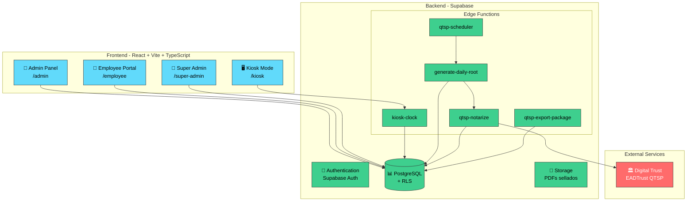

### Componentes Principales

| Componente | Tecnología | Propósito |
|------------|------------|-----------|
| Frontend | React 18 + Vite + TypeScript | SPA con múltiples paneles |
| UI Components | shadcn/ui + Tailwind CSS | Sistema de diseño consistente |
| State Management | TanStack Query | Cache y sincronización de datos |
| Backend | Supabase | Auth, DB, Storage, Edge Functions |
| Base de Datos | PostgreSQL + RLS | Almacenamiento con seguridad por fila |
| QTSP Provider | EADTrust / Digital Trust | Sellado de tiempo cualificado |

---

## 📊 Modelo de Datos

### Diagrama Entidad-Relación

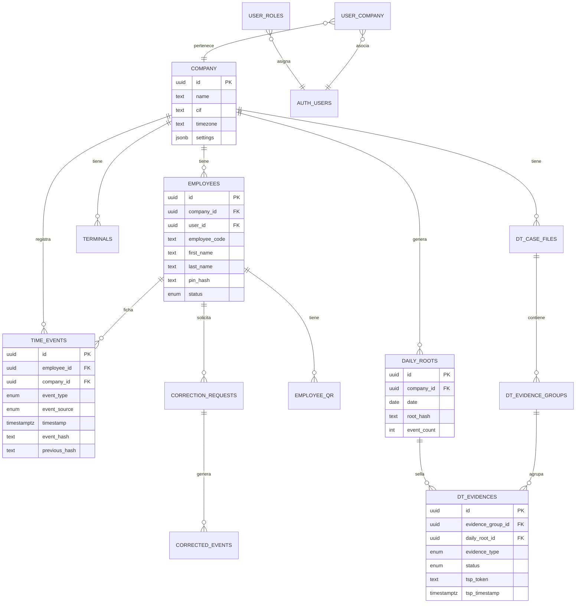

### Tablas Principales

| Tabla | Descripción | RLS |
|-------|-------------|-----|
| `company` | Empresas registradas en el sistema | Por empresa |
| `employees` | Empleados con sus credenciales (PIN hash) | Por empresa |
| `time_events` | Eventos de fichaje (inmutables) | Por empresa/empleado |
| `daily_roots` | Hash Merkle raíz diario por empresa | Por empresa |
| `dt_case_files` | Case Files de Digital Trust (1 por empresa) | Por empresa |
| `dt_evidence_groups` | Grupos de evidencia mensuales (YYYY-MM) | Por empresa |
| `dt_evidences` | Evidencias selladas (timestamp/PDF) | Por empresa |
| `correction_requests` | Solicitudes de corrección de fichaje | Por empresa/empleado |
| `corrected_events` | Eventos corregidos aprobados | Por empresa |
| `audit_log` | Log de auditoría general | Por empresa |
| `qtsp_audit_log` | Log específico de operaciones QTSP | Por empresa |
| `terminals` | Terminales/kioskos de fichaje | Por empresa |
| `employee_qr` | Códigos QR activos por empleado | Por empresa |
| `user_roles` | Roles asignados a usuarios | Por usuario |
| `user_company` | Asociación usuario-empresa | Por usuario |

---

## 👥 Roles y Permisos

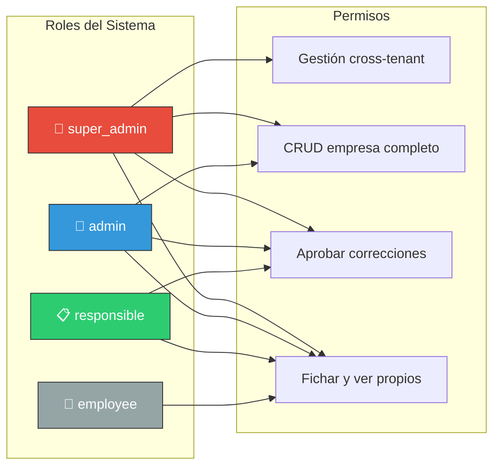

### Matriz de Permisos Detallada

| Acción | super_admin | admin | responsible | employee |
|--------|:-----------:|:-----:|:-----------:|:--------:|
| Ver todas las empresas | ✅ | ❌ | ❌ | ❌ |
| Crear empresas | ✅ | ❌ | ❌ | ❌ |
| Gestionar usuarios cross-tenant | ✅ | ❌ | ❌ | ❌ |
| Ver estadísticas globales | ✅ | ❌ | ❌ | ❌ |
| CRUD empleados | ✅ | ✅ | ❌ | ❌ |
| Gestionar terminales | ✅ | ✅ | ❌ | ❌ |
| Ver todos los fichajes | ✅ | ✅ | ✅ | ❌ |
| Aprobar correcciones | ✅ | ✅ | ✅ | ❌ |
| Generar reportes | ✅ | ✅ | ❌ | ❌ |
| Ver evidencias QTSP | ✅ | ✅ | ❌ | ❌ |
| Fichar (QR/PIN) | ❌ | ❌ | ❌ | ✅ |
| Ver fichajes propios | ✅ | ✅ | ✅ | ✅ |
| Solicitar correcciones | ❌ | ❌ | ❌ | ✅ |

---

## 📖 Historias de Usuario

### 👤 Empleado

| ID | Historia | Criterios de Aceptación |
|----|----------|-------------------------|
| E1 | Como empleado, quiero fichar mi entrada/salida con QR para registrar mi jornada | - Escaneo QR en < 2 segundos<br/>- Confirmación visual y sonora<br/>- Funciona offline |
| E2 | Como empleado, quiero fichar con código+PIN cuando no tenga mi QR | - Introducir código de empleado<br/>- PIN de 4-6 dígitos<br/>- Bloqueo tras 5 intentos fallidos |
| E3 | Como empleado, quiero ver mis fichajes del día/semana/mes | - Listado cronológico<br/>- Filtros por período<br/>- Horas totales calculadas |
| E4 | Como empleado, quiero solicitar una corrección si olvidé fichar | - Formulario con fecha/hora/motivo<br/>- Estado visible (pendiente/aprobada/rechazada)<br/>- Notificación de resolución |

### 👔 Administrador

| ID | Historia | Criterios de Aceptación |
|----|----------|-------------------------|
| A1 | Como admin, quiero dar de alta empleados y generar sus credenciales | - Formulario completo de datos<br/>- Generación automática de código QR<br/>- Configuración de PIN |
| A2 | Como admin, quiero ver el dashboard con fichajes en tiempo real | - Contador de empleados presentes<br/>- Últimos fichajes actualizados<br/>- Alertas de anomalías |
| A3 | Como admin, quiero aprobar/rechazar solicitudes de corrección | - Lista de pendientes<br/>- Detalle de solicitud<br/>- Campo de notas de revisión |
| A4 | Como admin, quiero generar reportes mensuales sellados con QTSP | - Selección de mes/empleado<br/>- PDF con firma cualificada<br/>- Verificable externamente |
| A5 | Como admin, quiero ver el calendario de evidencias QTSP | - Vista mensual<br/>- Estados: completado/pendiente/fallido<br/>- Acceso a detalles |

### 🔐 Super Admin

| ID | Historia | Criterios de Aceptación |
|----|----------|-------------------------|
| S1 | Como super admin, quiero ver todas las empresas del sistema | - Listado con métricas<br/>- Búsqueda y filtros<br/>- Acceso a detalles |
| S2 | Como super admin, quiero gestionar usuarios cross-tenant | - Cambio de roles<br/>- Asignación a empresas<br/>- Eliminación de usuarios |
| S3 | Como super admin, quiero ver estadísticas globales de QTSP | - Total de evidencias por estado<br/>- Alertas de fallos<br/>- Tendencias temporales |

---

## 🔐 Integración QTSP (Qualified Trust Service Provider)

### ¿Qué es QTSP?

Un **Qualified Trust Service Provider** (Prestador Cualificado de Servicios de Confianza) es una entidad acreditada por la UE para proporcionar servicios de firma electrónica, sellado de tiempo y otros servicios de confianza con validez legal según el Reglamento eIDAS.

Time Control Hub utiliza **EADTrust / Digital Trust** como QTSP para:
- **Sellado de tiempo cualificado**: Prueba de que los datos existían en un momento determinado
- **Firma cualificada de PDFs**: Documentos con validez legal equivalente a firma manuscrita

### Arquitectura QTSP

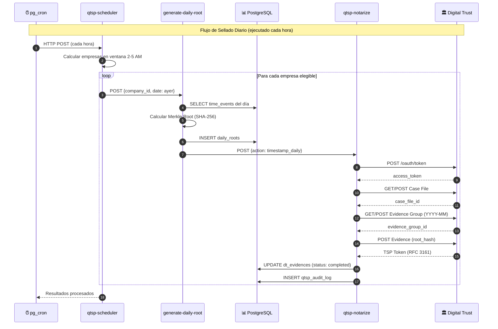

### Modelo Multi-empresa en Digital Trust

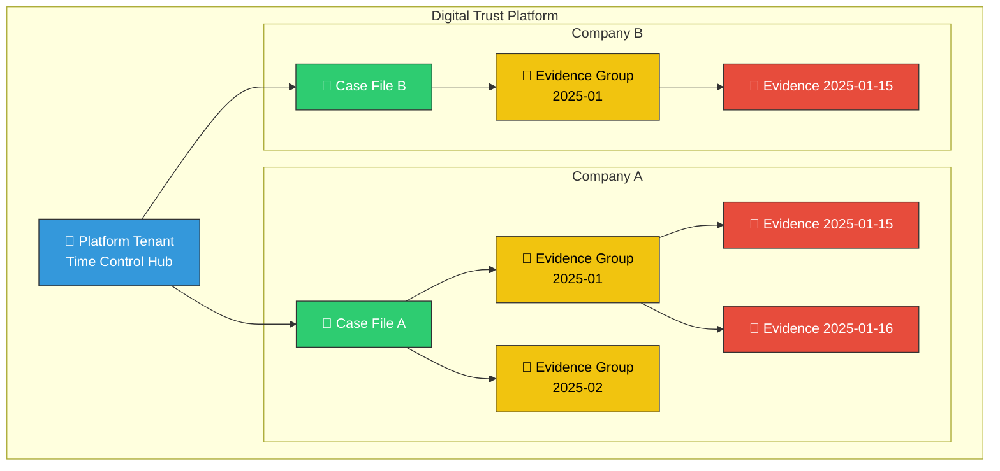

### Algoritmo Hash-Chain

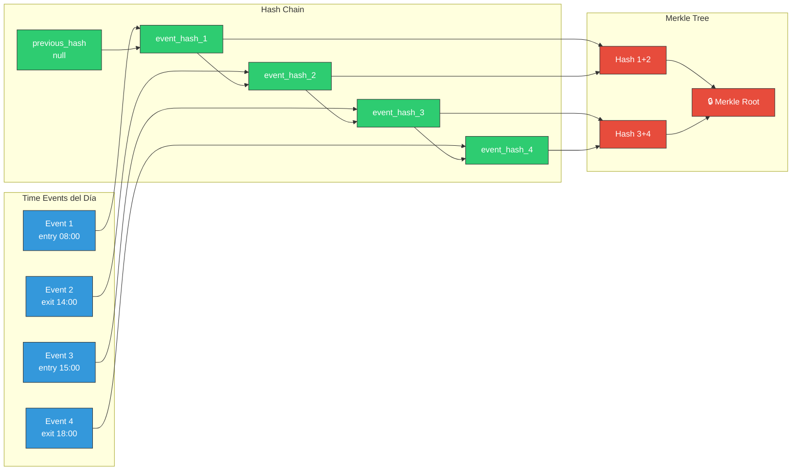

#### Pseudocódigo

```typescript
// Cada time_event tiene un hash encadenado:
event_hash = SHA256(
  employee_id + "|" + 
  event_type + "|" + 
  timestamp + "|" + 
  previous_hash
)

// El daily_root es el Merkle Root de todos los hashes del día:
function buildMerkleRoot(hashes: string[]): string {
  if (hashes.length === 0) return SHA256("empty")
  if (hashes.length === 1) return hashes[0]
  
  const nextLevel = []
  for (let i = 0; i < hashes.length; i += 2) {
    const left = hashes[i]
    const right = hashes[i + 1] || left
    nextLevel.push(SHA256(left + right))
  }
  return buildMerkleRoot(nextLevel)
}
```

### Tablas QTSP

| Tabla | Propósito | Campos Clave |
|-------|-----------|--------------|
| `daily_roots` | Hash Merkle raíz diario | `date`, `root_hash`, `event_count`, `company_id` |
| `dt_case_files` | Case Files (1 por empresa) | `external_id`, `name`, `company_id` |
| `dt_evidence_groups` | Grupos mensuales | `year_month`, `external_id`, `case_file_id` |
| `dt_evidences` | Evidencias individuales | `evidence_type`, `status`, `tsp_token`, `daily_root_id` |
| `qtsp_audit_log` | Log de operaciones | `action`, `status`, `duration_ms`, `error_message` |

### Estados de Evidencia

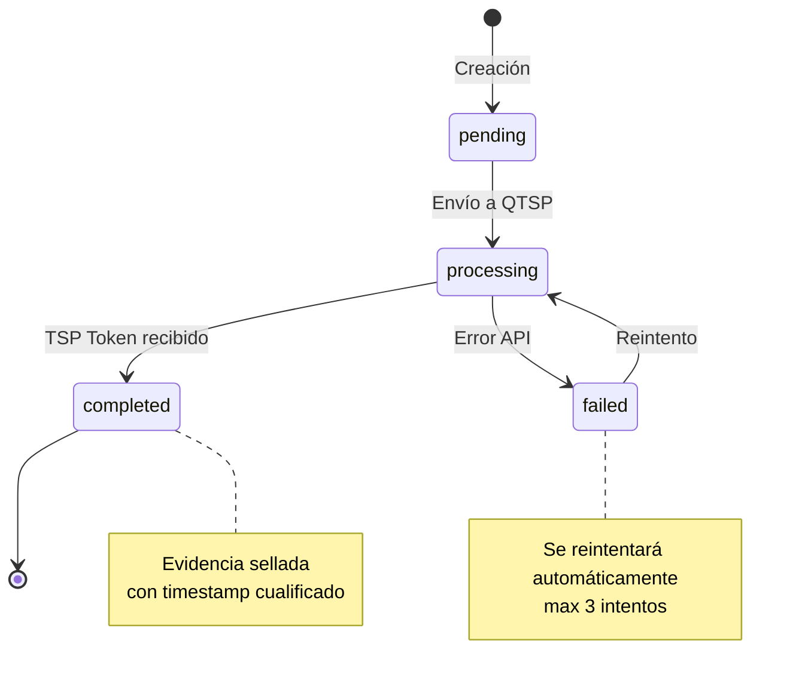

### Acciones de qtsp-notarize

| Acción | Descripción | Parámetros |
|--------|-------------|------------|
| `health_check` | Verifica conectividad y autenticación con QTSP | Ninguno |
| `timestamp_daily` | Sella hash diario con timestamp cualificado | `company_id`, `daily_root_id` |
| `seal_pdf` | Sella PDF mensual con firma cualificada | `company_id`, `report_month`, `pdf_path` |
| `check_status` | Verifica estado de evidencias en procesamiento | `company_id` |
| `retry_failed` | Reintenta evidencias fallidas | `company_id` |

### Gestión de Health y Monitorización QTSP

El sistema incluye un monitor de salud integrado para supervisar la conectividad con Digital Trust:

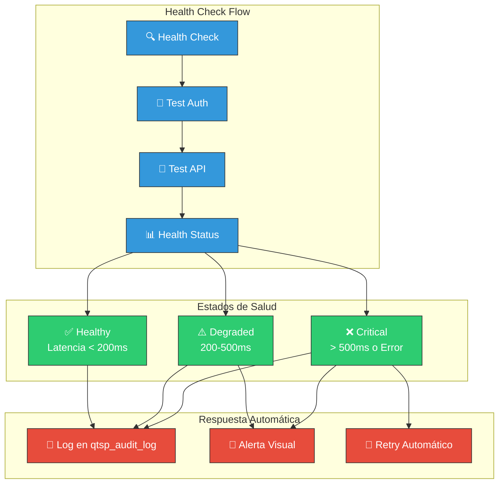

#### Respuesta del Health Check

```typescript
interface HealthCheckResult {
  status: 'healthy' | 'degraded' | 'unhealthy';
  latency_ms: number;
  auth_ok: boolean;
  api_reachable: boolean;
  last_check: string;      // ISO timestamp
  error?: string;          // Solo si hay error
}
```

#### Gráfico de Latencia en Tiempo Real

El panel Super Admin incluye un gráfico de historial de latencia que:
- Muestra los últimos 15 minutos de datos
- Actualiza automáticamente cada 30 segundos
- Visualiza umbrales de rendimiento (healthy/degraded/critical)
- Permite identificar patrones de degradación

### Secretos Requeridos

| Secreto | Descripción | Ejemplo |
|---------|-------------|---------|
| `DIGITALTRUST_API_URL` | URL base de la API | `https://api.digitaltrust.example.com` |
| `DIGITALTRUST_LOGIN_URL` | URL de autenticación OAuth | `https://auth.digitaltrust.example.com/oauth/token` |
| `DIGITALTRUST_CLIENT_ID` | ID del cliente OAuth | `timecontrol-prod` |
| `DIGITALTRUST_CLIENT_SECRET` | Secret del cliente OAuth | `****` |

### Exportación de Paquete Probatorio

La Edge Function `qtsp-export-package` genera un paquete JSON completo para auditorías:

```json
{
  "version": "1.0",
  "generated_at": "2025-01-05T10:30:00Z",
  "company": {
    "id": "uuid",
    "name": "Empresa S.L.",
    "cif": "B12345678"
  },
  "period": {
    "start": "2025-01-01",
    "end": "2025-01-31"
  },
  "case_file": {
    "id": "uuid",
    "external_id": "dt-casefile-123"
  },
  "evidence_groups": [...],
  "evidences": [...],
  "daily_roots": [...],
  "integrity": {
    "algorithm": "SHA-256",
    "hash": "abc123..."
  },
  "statistics": {
    "total_days": 31,
    "days_with_events": 22,
    "total_evidences": 22,
    "completed_evidences": 22
  }
}
```

---

## ⚡ Edge Functions

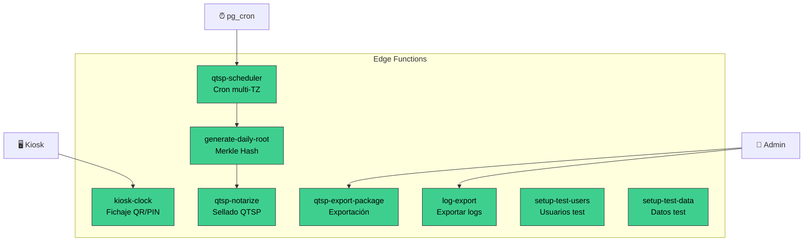

| Función | Propósito | JWT | Trigger |
|---------|-----------|:---:|---------|
| `kiosk-clock` | Procesa fichajes QR/PIN desde terminales kiosk | ❌ | HTTP POST desde kiosk |
| `generate-daily-root` | Calcula y almacena Merkle root de eventos diarios | ❌ | Llamada desde scheduler |
| `qtsp-notarize` | Gestiona sellado con Digital Trust (timestamp, PDF, health) | ❌ | Llamada desde generate-daily-root o manual |
| `qtsp-scheduler` | Coordina sellado automático respetando timezones | ❌ | pg_cron cada hora |
| `qtsp-export-package` | Genera paquete probatorio JSON para auditorías | ❌ | HTTP POST desde admin |
| `log-export` | Exporta logs de auditoría en formato CSV/JSON | ❌ | HTTP POST desde admin |
| `setup-test-users` | Crea usuarios de prueba con roles predefinidos | ❌ | Manual |
| `setup-test-data` | Genera datos de prueba (empresas, empleados, fichajes) | ❌ | Manual |

### Detalle de Edge Functions

#### `kiosk-clock`
Procesa fichajes desde terminales kiosk, validando credenciales QR o PIN.

```typescript
// Request
POST /functions/v1/kiosk-clock
{
  "action": "clock",
  "terminal_id": "uuid",
  "credential_type": "qr" | "pin",
  "credential": "token_or_pin",
  "employee_code": "EMP001",  // Solo para PIN
  "event_type": "entry" | "exit"
}

// Response
{
  "success": true,
  "event_id": "uuid",
  "employee_name": "Juan García",
  "event_type": "entry",
  "timestamp": "2025-01-05T09:00:00Z"
}
```

#### `generate-daily-root`
Calcula el hash Merkle raíz de todos los eventos del día para una empresa.

```typescript
// Request
POST /functions/v1/generate-daily-root
{
  "company_id": "uuid",
  "date": "2025-01-04"  // Fecha a procesar (normalmente ayer)
}

// Response
{
  "success": true,
  "daily_root_id": "uuid",
  "root_hash": "sha256...",
  "event_count": 42,
  "notarization_triggered": true
}
```

#### `qtsp-notarize`
Gestiona todas las operaciones con Digital Trust QTSP.

```typescript
// Health Check
POST /functions/v1/qtsp-notarize
{ "action": "health_check" }

// Response
{
  "status": "healthy",
  "latency_ms": 145,
  "auth_ok": true,
  "api_reachable": true,
  "last_check": "2025-01-05T10:30:00Z"
}

// Timestamp Daily
POST /functions/v1/qtsp-notarize
{
  "action": "timestamp_daily",
  "company_id": "uuid",
  "daily_root_id": "uuid"
}

// Check Status
POST /functions/v1/qtsp-notarize
{
  "action": "check_status",
  "company_id": "uuid"
}

// Response
{
  "checked": 3,
  "completed": 2,
  "still_processing": 1,
  "details": [...]
}

// Retry Failed
POST /functions/v1/qtsp-notarize
{
  "action": "retry_failed",
  "company_id": "uuid"
}
```

#### `qtsp-scheduler`
Orquesta el sellado automático respetando las zonas horarias de cada empresa.

```typescript
// Ejecutado por pg_cron cada hora
POST /functions/v1/qtsp-scheduler
{}

// Response
{
  "executed_at": "2025-01-05T03:00:00Z",
  "companies_processed": 5,
  "results": [
    { "company_id": "uuid", "status": "success", "daily_root_id": "uuid" },
    { "company_id": "uuid", "status": "skipped", "reason": "outside_window" }
  ]
}
```

#### `qtsp-export-package`
Genera paquete probatorio completo para auditorías externas.

```typescript
// Request
POST /functions/v1/qtsp-export-package
{
  "company_id": "uuid",
  "start_date": "2025-01-01",
  "end_date": "2025-01-31"
}

// Response: JSON con todo el paquete probatorio
// Ver sección "Exportación de Paquete Probatorio" para estructura completa
```

#### `log-export`
Exporta registros de auditoría en diferentes formatos.

```typescript
// Request
POST /functions/v1/log-export
{
  "company_id": "uuid",
  "start_date": "2025-01-01",
  "end_date": "2025-01-31",
  "format": "csv" | "json",
  "log_type": "audit" | "qtsp"
}
```

#### `setup-test-data`
Genera datos de prueba para desarrollo y testing.

```typescript
// Request
POST /functions/v1/setup-test-data
{
  "company_id": "uuid",
  "num_employees": 10,
  "days_of_events": 30
}
```

---

## 📱 Modo Offline (PWA)

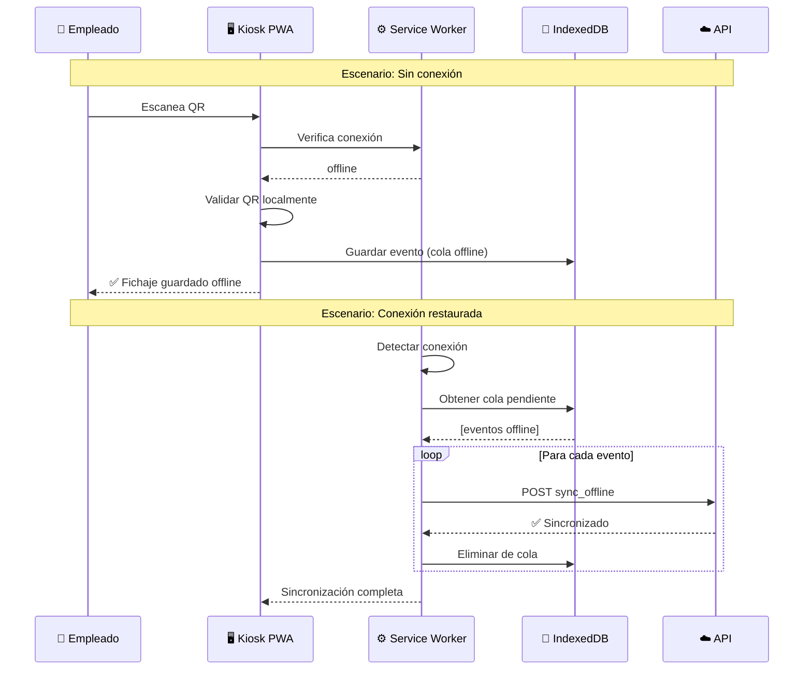

### Características PWA

| Característica | Implementación |
|----------------|----------------|
| **Service Worker** | Vite PWA Plugin para cache de assets |
| **IndexedDB** | Cola de fichajes offline encriptados |
| **Detección de Red** | Hook `useConnectionStatus` |
| **Sincronización** | Automática al recuperar conexión |
| **Encriptación Local** | AES-GCM para datos sensibles (PIN) |

### Estructura de Cola Offline

```typescript
interface OfflineEvent {
  uuid: string;           // UUID único generado localmente
  employee_id: string;    // ID del empleado (del QR)
  event_type: 'entry' | 'exit';
  local_timestamp: string; // ISO timestamp local
  timezone: string;
  event_source: 'qr' | 'pin';
  qr_version?: number;
  created_at: string;
}
```

---

## 🔒 Seguridad

### Row Level Security (RLS)

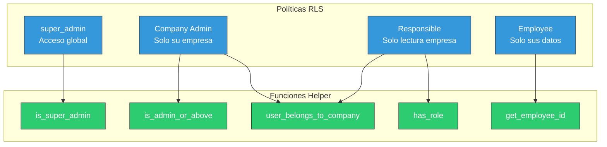

### Medidas de Seguridad

| Área | Medida |
|------|--------|
| **Autenticación** | Supabase Auth con email/password |
| **Autorización** | RLS en todas las tablas |
| **Multi-tenancy** | Aislamiento completo por `company_id` |
| **PINs** | Hash con salt (SHA-256) |
| **Bloqueo** | Cuenta bloqueada tras 5 intentos fallidos |
| **Inmutabilidad** | `time_events` solo INSERT (sin UPDATE/DELETE) |
| **Hash Chain** | Cada evento referencia al anterior |
| **Auditoría** | Log completo de todas las acciones |
| **QTSP** | Sellado cualificado con validez legal |
| **Offline** | Encriptación AES-GCM en IndexedDB |

### Ejemplo de Política RLS

```sql
-- Empleados solo pueden ver sus propios fichajes
CREATE POLICY "mt_te_employee_own" 
ON public.time_events 
FOR SELECT 
USING (employee_id = get_employee_id(auth.uid()));

-- Admins pueden ver todos los fichajes de su empresa
CREATE POLICY "mt_te_company_admin" 
ON public.time_events 
FOR SELECT 
USING (
  user_belongs_to_company(auth.uid(), company_id) 
  AND is_admin_or_above(auth.uid())
);
```

---

## 🛠 Instalación y Configuración

### Requisitos Previos

- Node.js 18+
- npm o bun
- Cuenta en Lovable.dev (backend incluido)

### Variables de Entorno

```env
# Generadas automáticamente por Lovable Cloud
VITE_SUPABASE_URL=https://xxx.supabase.co
VITE_SUPABASE_PUBLISHABLE_KEY=eyJ...
VITE_SUPABASE_PROJECT_ID=xxx

# Secretos para QTSP (configurar en Lovable)
DIGITALTRUST_API_URL=https://api.digitaltrust.example.com
DIGITALTRUST_LOGIN_URL=https://auth.digitaltrust.example.com/oauth/token
DIGITALTRUST_CLIENT_ID=your-client-id
DIGITALTRUST_CLIENT_SECRET=your-secret
```

### Desarrollo Local

```bash
# Clonar repositorio
git clone <YOUR_GIT_URL>
cd <YOUR_PROJECT_NAME>

# Instalar dependencias
npm install

# Iniciar servidor de desarrollo
npm run dev
```

### Configuración de QTSP

1. **Obtener credenciales** de EADTrust/Digital Trust
2. **Configurar secretos** en Lovable Cloud → Secrets
3. **Verificar cron job** `qtsp-scheduler-hourly` activo
4. **Probar conexión** con una empresa de prueba

### Configuración del Cron Job

```sql
-- Habilitado automáticamente
SELECT cron.schedule(
  'qtsp-scheduler-hourly',
  '0 * * * *',  -- Cada hora en punto
  $$
  SELECT net.http_post(
    url := 'https://PROJECT_ID.supabase.co/functions/v1/qtsp-scheduler',
    headers := '{"Content-Type": "application/json", "Authorization": "Bearer ANON_KEY"}'::jsonb,
    body := '{}'::jsonb
  );
  $$
);
```

---

## 🧪 Pruebas Realizadas

### Pruebas de Integración QTSP

Las siguientes pruebas se han ejecutado para validar la integración completa con Digital Trust:

| Prueba | Fecha | Resultado | Observaciones |
|--------|-------|-----------|---------------|
| **Health Check API** | 2025-01-05 | ✅ Passed | Latencia ~145ms, autenticación OAuth2 exitosa |
| **Crear Case File** | 2025-01-05 | ✅ Passed | Case File creado en Digital Trust correctamente |
| **Crear Evidence Group** | 2025-01-05 | ✅ Passed | Grupo mensual 2025-01 creado |
| **Timestamp Daily (TSP)** | 2025-01-05 | ⏳ Processing | Evidencia creada, esperando TSP token RFC 3161 |
| **Check Status** | 2025-01-05 | ✅ Passed | Polling de estado funciona correctamente |
| **Retry Failed** | 2025-01-05 | ✅ Passed | Sin evidencias fallidas para reintentar |

### Flujo de Prueba Ejecutado

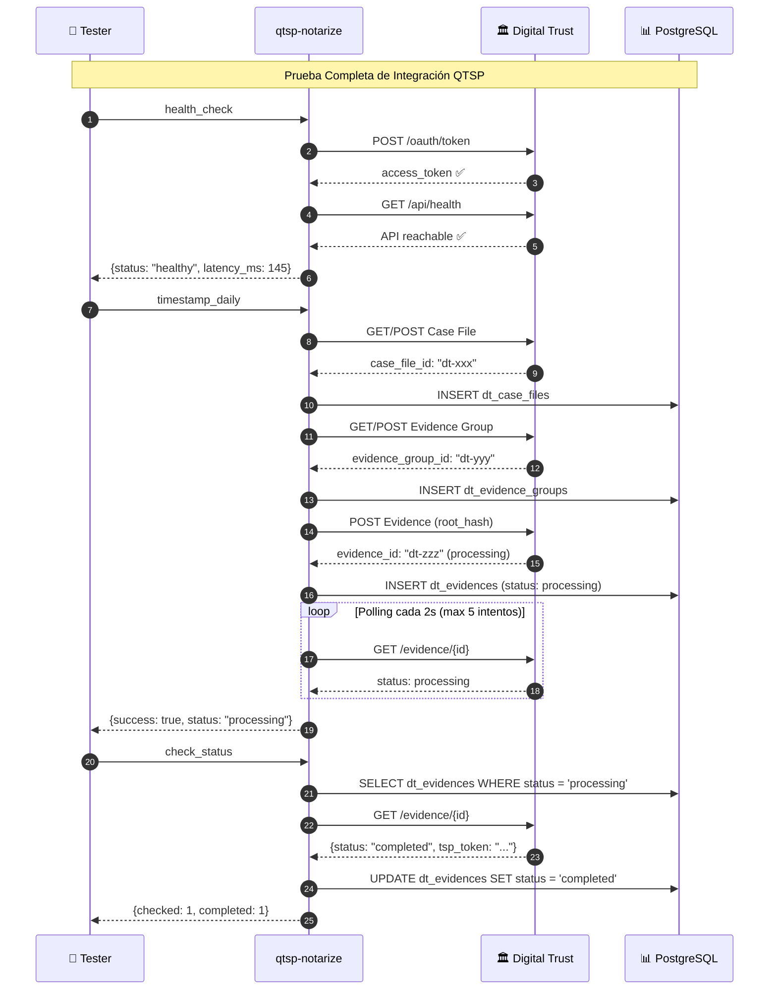

### Datos de Prueba Utilizados

| Entidad | ID/Valor | Descripción |
|---------|----------|-------------|
| Company | `empresa_prueba_qtsp` | Empresa de prueba para validación |
| Daily Root | Hash SHA-256 | Merkle root de eventos del día |
| Evidence Type | `daily_timestamp` | Tipo de evidencia para sellado diario |
| Case File | Creado en Digital Trust | Expediente único por empresa |
| Evidence Group | `2025-01` | Agrupación mensual de evidencias |

### Métricas de Rendimiento Observadas

| Métrica | Valor | Umbral Aceptable |
|---------|-------|------------------|
| Latencia autenticación OAuth | ~100ms | < 500ms |
| Latencia creación evidencia | ~200ms | < 1000ms |
| Tiempo total timestamp_daily | ~2-3s | < 10s |
| Polling hasta TSP token | Variable | < 5 min típico |

### Pruebas Pendientes

| Prueba | Estado | Notas |
|--------|--------|-------|
| Sellado PDF mensual | ❌ Bloqueado | Error 404 en endpoint evidence-groups. La API de DT devuelve ID en búsqueda que no corresponde a evidence group válido. Requiere investigación de endpoints correctos. |
| Retry de evidencias fallidas | ✅ Validado (sin fallos) | Simular fallo para test completo |
| Exportación paquete probatorio | 🔜 Pendiente | Requiere evidencias completadas |
| Alertas por email | 🔜 Pendiente | Requiere configuración Resend |

### Incidencias Detectadas

| Incidencia | Descripción | Acción Requerida |
|------------|-------------|------------------|
| Evidence Group ID inconsistente | La búsqueda global de evidence-groups en DT devuelve IDs que no funcionan en el endpoint de creación de evidencias | Verificar documentación de API Digital Trust para endpoints correctos |
| Constraint daily_roots | El constraint unique es solo por `date`, debería ser por `(date, company_id)` | Migración para corregir constraint |

---

## 📄 Licencia

Proyecto propietario - Todos los derechos reservados.

---

## 📞 Contacto

Para soporte técnico o consultas comerciales, contactar al equipo de desarrollo.

---

<p align="center">
  <strong>Time Control Hub</strong> - Sistema de Control Horario con Sellado Cualificado<br/>
  Desarrollado con ❤️ usando React, Supabase y Digital Trust
</p>
