# Time Control Hub

[](https://reactjs.org/)
[](https://www.typescriptlang.org/)
[](https://supabase.com/)
[](https://tailwindcss.com/)
[](https://web.dev/progressive-web-apps/)
[](https://digital-strategy.ec.europa.eu/en/policies/eidas-regulation)
[](https://esignature.ec.europa.eu/efda/tl-browser/)

**Plataforma integral de control horario y cumplimiento laboral con sellado de tiempo cualificado (QTSP)** conforme al Reglamento eIDAS, Real Decreto-ley 8/2019 y normativa española de registro de jornada.

> 🏛️ **Time Control Hub opera como Prestador Cualificado de Servicios de Confianza (QTSP)** integrando servicios de firma electrónica cualificada, sellos de tiempo RFC 3161, notificaciones certificadas y custodia de documentos críticos.

---

## 📋 Tabla de Contenidos

1. [Visión General](#-visión-general)
2. [Características Principales](#-características-principales)
3. [Arquitectura del Sistema](#-arquitectura-del-sistema)
4. [Roles y Experiencia de Usuario (UX)](#-roles-y-experiencia-de-usuario-ux)
5. [Sistema de Cumplimiento Legal](#-sistema-de-cumplimiento-legal)
6. [Integración QTSP](#-integración-qtsp-qualified-trust-service-provider)
7. [Generador de Paquetes ITSS](#-generador-de-paquetes-itss)
8. [Sistema de Plantillas y Convenios](#-sistema-de-plantillas-y-convenios)
9. [Gestión de Ausencias](#-gestión-de-ausencias)
10. [Calendario Laboral](#-calendario-laboral)
11. [Portal del Asesor Laboral](#-portal-del-asesor-laboral)
12. [Documentos Legales](#-documentos-legales)
13. [Sistema de Notificaciones](#-sistema-de-notificaciones)
14. [Modelo de Datos](#-modelo-de-datos)
15. [Edge Functions](#-edge-functions)
16. [Modo Offline (PWA)](#-modo-offline-pwa)
17. [Seguridad](#-seguridad)
18. [Instalación y Configuración](#-instalación-y-configuración)

---

## 🎯 Visión General

Time Control Hub es una **plataforma empresarial completa** diseñada para:

### Cumplimiento Normativo
- **RD-ley 8/2019**: Registro obligatorio de jornada laboral
- **Reglamento eIDAS**: Servicios de confianza cualificados
- **RGPD/LOPDGDD**: Protección de datos y privacidad
- **Estatuto de los Trabajadores**: Límites de jornada, descansos, horas extra
- **Convenios colectivos**: Configuración específica por sector

### Valor Diferencial
- **Evidencia legal irrefutable**: Sellado QTSP de todos los registros
- **Proactividad en cumplimiento**: Detección automática de violaciones
- **Preparación ante inspección**: Generador de paquetes ITSS completos
- **Colaboración con asesores**: Portal dedicado para asesores laborales

---

## 🚀 Características Principales

| Módulo | Características |
|--------|-----------------|
| **Control de Fichaje** | QR dinámico, PIN numérico, modo kiosk, offline PWA |
| **Multi-empresa** | Aislamiento RLS, multi-centro, multi-zona horaria |
| **QTSP Integrado** | Firma cualificada, sellos RFC 3161, notificaciones certificadas |
| **Cumplimiento** | Evaluador automático, semáforo de riesgo, alertas proactivas |
| **Generador ITSS** | Paquete completo 6 módulos para Inspección de Trabajo |
| **Calendario Laboral** | Festivos nacionales/autonómicos/locales, jornada intensiva |
| **Plantillas/Convenios** | Configuración por sector, simulador de jornadas |
| **Ausencias** | 25+ tipos de ausencia, workflow aprobación, justificantes |
| **Documentos Legales** | 14 plantillas, aceptación con sellado QTSP |
| **Portal Asesor** | Acceso colaborativo, alertas, análisis de riesgos |
| **Retención de Datos** | Purga automática 4 años, evidencia QTSP previa |
| **Reporting** | PDF sellados, CSV técnico, exportación auditoría |

---

## 🏗 Arquitectura del Sistema

### Diagrama General

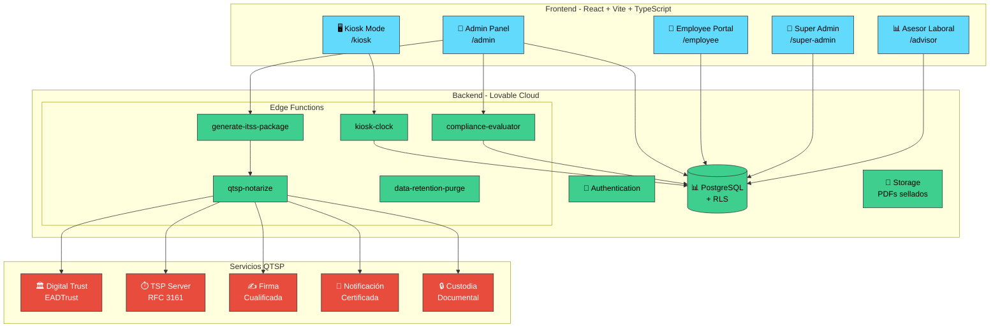

### Stack Tecnológico

| Capa | Tecnología | Propósito |
|------|------------|-----------|
| Frontend | React 18 + Vite + TypeScript | SPA multi-panel responsive |
| UI | shadcn/ui + Tailwind CSS | Design system consistente |
| State | TanStack Query | Cache, sincronización, offline |
| Backend | Lovable Cloud (Supabase) | Auth, DB, Storage, Edge Functions |
| Base de Datos | PostgreSQL + RLS | Multi-tenancy seguro |
| QTSP | EADTrust / Digital Trust | Firma, sellos, custodia |
| Cron | pg_cron + pg_net | Automatizaciones programadas |

---

## 👥 Roles y Experiencia de Usuario (UX)

### Jerarquía de Roles

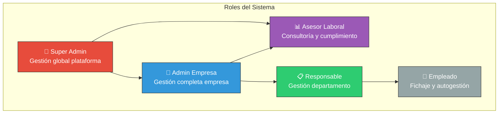

### Matriz de Permisos Detallada

| Funcionalidad | Super Admin | Admin | Asesor | Responsable | Empleado |
|---------------|:-----------:|:-----:|:------:|:-----------:|:--------:|
| **Gestión Global** |||||
| Ver todas las empresas | ✅ | ❌ | ❌ | ❌ | ❌ |
| Crear/eliminar empresas | ✅ | ❌ | ❌ | ❌ | ❌ |
| Monitor QTSP global | ✅ | ❌ | ❌ | ❌ | ❌ |
| **Gestión Empresa** |||||
| CRUD empleados | ✅ | ✅ | 👁️ | ❌ | ❌ |
| Gestionar terminales | ✅ | ✅ | ❌ | ❌ | ❌ |
| Configurar plantillas | ✅ | ✅ | 💡 | ❌ | ❌ |
| Gestionar ausencias | ✅ | ✅ | 👁️ | ✅* | ❌ |
| **Cumplimiento** |||||
| Ver dashboard compliance | ✅ | ✅ | ✅ | 👁️* | ❌ |
| Generar paquete ITSS | ✅ | ✅ | ✅ | ❌ | ❌ |
| Gestionar incidencias | ✅ | ✅ | ✅ | ❌ | ❌ |
| Configurar reglas | ✅ | ✅ | 💡 | ❌ | ❌ |
| **Documentos** |||||
| Crear documentos legales | ✅ | ✅ | 💡 | ❌ | ❌ |
| Ver evidencias QTSP | ✅ | ✅ | ✅ | ❌ | ❌ |
| Exportar reportes | ✅ | ✅ | ✅ | ✅* | ✅* |
| **Fichajes** |||||
| Ver todos los fichajes | ✅ | ✅ | ✅ | ✅* | ❌ |
| Aprobar correcciones | ✅ | ✅ | ❌ | ✅ | ❌ |
| Fichar (QR/PIN) | ❌ | ❌ | ❌ | ❌ | ✅ |
| Ver fichajes propios | ✅ | ✅ | ❌ | ✅ | ✅ |
| Solicitar corrección | ❌ | ❌ | ❌ | ✅ | ✅ |

**Leyenda**: ✅ Acceso completo | 👁️ Solo lectura | 💡 Puede sugerir/proponer | ✅* Solo su departamento/propios

---

### Experiencia de Usuario por Rol

#### 👤 Empleado - Portal Self-Service

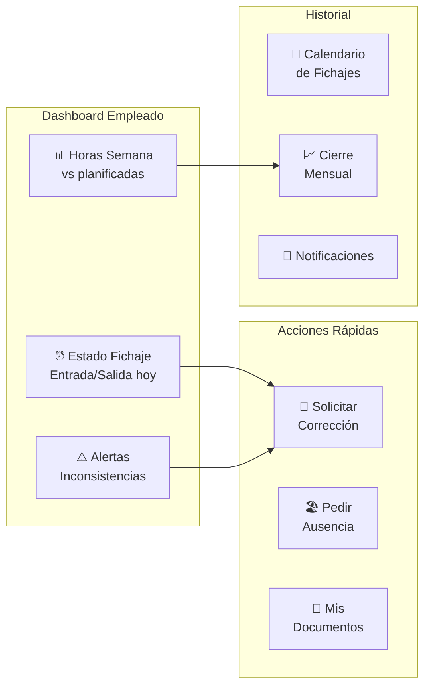

**UX Highlights**:
- Dashboard minimalista con estado actual prominente
- Acceso directo a corrección desde alertas
- Calendario visual de fichajes con códigos de color
- Firma digital del cierre mensual
- Notificaciones push de incidencias

#### 👔 Admin - Centro de Control

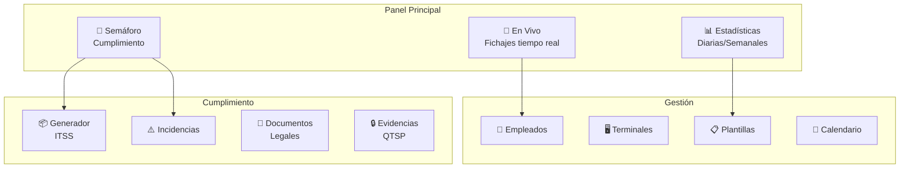

**UX Highlights**:
- Vista en tiempo real de quién está fichado
- Semáforo de cumplimiento siempre visible
- Acceso rápido a generador ITSS
- Alertas proactivas de violaciones
- Drill-down desde estadísticas a detalle

#### 📊 Asesor Laboral - Consultoría Proactiva

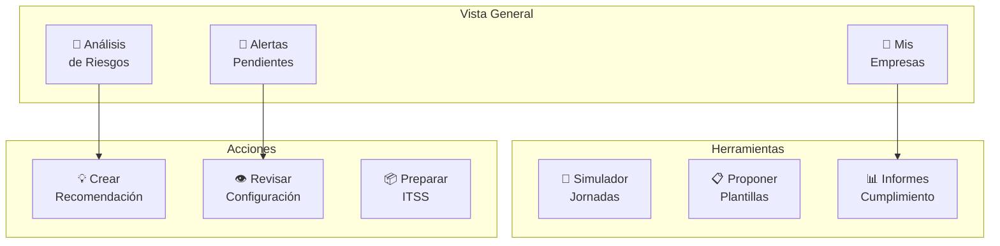

---

## ⚖️ Sistema de Cumplimiento Legal

### Arquitectura del Evaluador de Cumplimiento

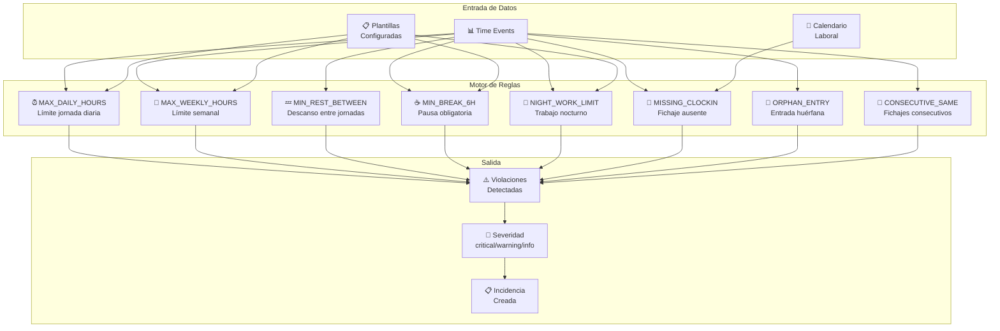

### Reglas de Cumplimiento Implementadas

| Código | Nombre | Descripción | Severidad | Base Legal |
|--------|--------|-------------|-----------|------------|
| `MAX_DAILY_HOURS` | Jornada diaria excesiva | > 9h diarias (o límite plantilla) | Critical | ET Art. 34.3 |
| `MAX_WEEKLY_HOURS` | Jornada semanal excesiva | > 40h semanales (o convenio) | Critical | ET Art. 34.1 |
| `MIN_REST_BETWEEN` | Descanso insuficiente | < 12h entre fin e inicio jornada | Critical | ET Art. 34.3 |
| `MIN_BREAK_6H` | Pausa no realizada | Sin pausa de 15min en jornadas > 6h | Warning | ET Art. 34.4 |
| `NIGHT_WORK_LIMIT` | Trabajo nocturno excesivo | > 8h noche o límites convenio | Critical | ET Art. 36 |
| `MISSING_CLOCKIN` | Fichaje ausente | Día laborable sin ningún registro | Warning | RD-ley 8/2019 |
| `ORPHAN_ENTRY` | Entrada huérfana | Entrada sin salida > 12h | Warning | RD-ley 8/2019 |
| `CONSECUTIVE_SAME` | Fichajes consecutivos | Dos entradas/salidas seguidas | Info | RD-ley 8/2019 |
| `OVERTIME_LIMIT` | Horas extra excesivas | > 80h/año de horas extraordinarias | Critical | ET Art. 35.2 |

### Dashboard de Cumplimiento

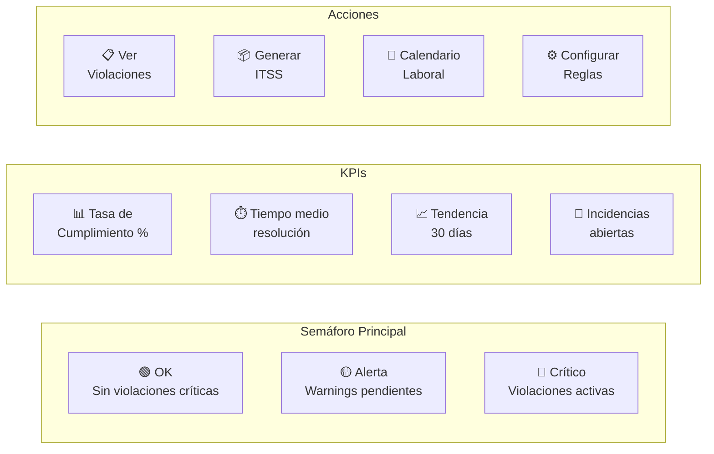

### Flujo de Gestión de Incidencias

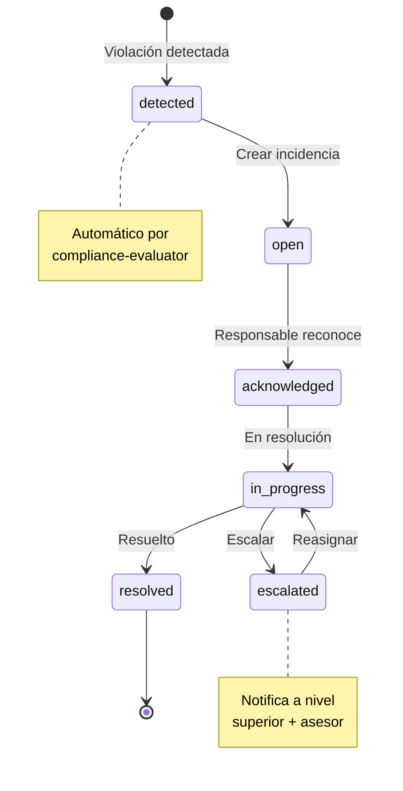

---

## 🏛️ Integración QTSP (Qualified Trust Service Provider)

### Visión como QTSP

Time Control Hub **opera como Prestador Cualificado de Servicios de Confianza** integrando los siguientes servicios vía API:

```mermaid
graph TB
    subgraph "Servicios QTSP Integrados"
        subgraph "Firma Electrónica"
            QES[✍️ Firma Electrónica<br/>Cualificada (QES)]
            AES[📝 Firma Electrónica<br/>Avanzada (AES)]
        end
        
        subgraph "Sellos de Tiempo"
            TSP[⏱️ Sellos Cualificados<br/>RFC 3161]
            MERKLE[🌳 Merkle Tree<br/>Hash Chain]
        end
        
        subgraph "Notificaciones"
            CERT_EMAIL[📧 Email<br/>Certificado]
            CERT_SMS[📱 SMS<br/>Certificado]
        end
        
        subgraph "Custodia"
            CUSTODY[🔒 Repositorio<br/>Documental]
            ARCHIVE[📁 Archivo<br/>a Largo Plazo]
        end
    end

    subgraph "Casos de Uso"
        DAILY[📊 Sellado Diario<br/>de Fichajes]
        MONTHLY[📈 Cierre Mensual<br/>Firmado]
        DOCS[📄 Documentos<br/>Legales]
        ITSS[📦 Paquete<br/>ITSS]
        NOTIFY[🔔 Notificaciones<br/>a Empleados]
    end

    DAILY --> TSP
    DAILY --> MERKLE
    MONTHLY --> QES
    MONTHLY --> TSP
    DOCS --> AES
    DOCS --> CUSTODY
    ITSS --> TSP
    ITSS --> ARCHIVE
    NOTIFY --> CERT_EMAIL

    classDef service fill:#e74c3c,stroke:#333,color:#fff
    classDef usecase fill:#3498db,stroke:#333,color:#fff
    
    class QES,AES,TSP,MERKLE,CERT_EMAIL,CERT_SMS,CUSTODY,ARCHIVE service
    class DAILY,MONTHLY,DOCS,ITSS,NOTIFY usecase
```

### Arquitectura de Sellado Diario

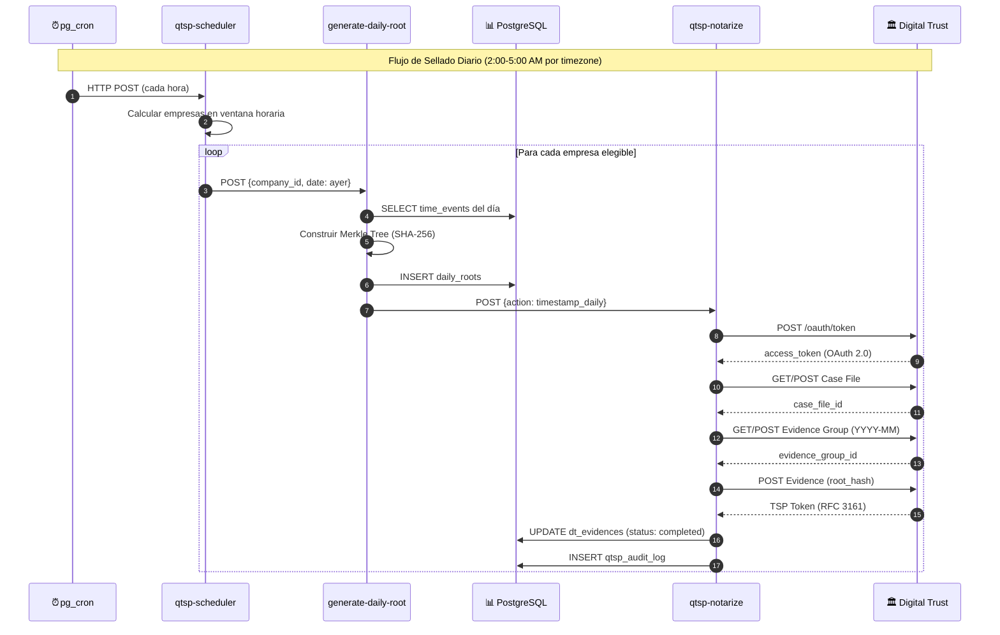

### Algoritmo Hash-Chain y Merkle Tree

```mermaid
graph LR
    subgraph "Eventos del Día (inmutables)"
        E1[Event 1<br/>entry 08:00]
        E2[Event 2<br/>exit 14:00]
        E3[Event 3<br/>entry 15:00]
        E4[Event 4<br/>exit 18:00]
    end

    subgraph "Hash Chain (cada evento)"
        H1[hash_1 = SHA256<br/>emp_id + type + ts + prev_hash]
        H2[hash_2 = SHA256<br/>emp_id + type + ts + hash_1]
        H3[hash_3 = SHA256<br/>emp_id + type + ts + hash_2]
        H4[hash_4 = SHA256<br/>emp_id + type + ts + hash_3]
    end

    subgraph "Merkle Tree"
        M1[SHA256<br/>hash_1 + hash_2]
        M2[SHA256<br/>hash_3 + hash_4]
        ROOT[🔒 Merkle Root<br/>SHA256(M1 + M2)]
    end

    subgraph "QTSP"
        TSP[⏱️ TSP Token<br/>RFC 3161]
    end

    E1 --> H1
    E2 --> H2
    E3 --> H3
    E4 --> H4
    
    H1 --> M1
    H2 --> M1
    H3 --> M2
    H4 --> M2
    M1 --> ROOT
    M2 --> ROOT
    ROOT --> TSP
```

### Servicios QTSP Disponibles

| Servicio | API Endpoint | Uso en Time Control Hub |
|----------|--------------|-------------------------|
| **Firma Cualificada (QES)** | `/signatures/qualified` | Cierre mensual, documentos críticos |
| **Firma Avanzada (AES)** | `/signatures/advanced` | Aceptación documentos empleados |
| **Sello de Tiempo (TSA)** | `/timestamps` | Hash diario, PDFs, paquetes ITSS |
| **Email Certificado** | `/notifications/email` | Alertas cumplimiento, incidencias |
| **SMS Certificado** | `/notifications/sms` | Alertas críticas urgentes |
| **Custodia Documental** | `/custody/documents` | Documentos legales, cierres firmados |
| **Verificación** | `/verify` | Validación de firmas y sellos |

### Tabla de Estados de Evidencia

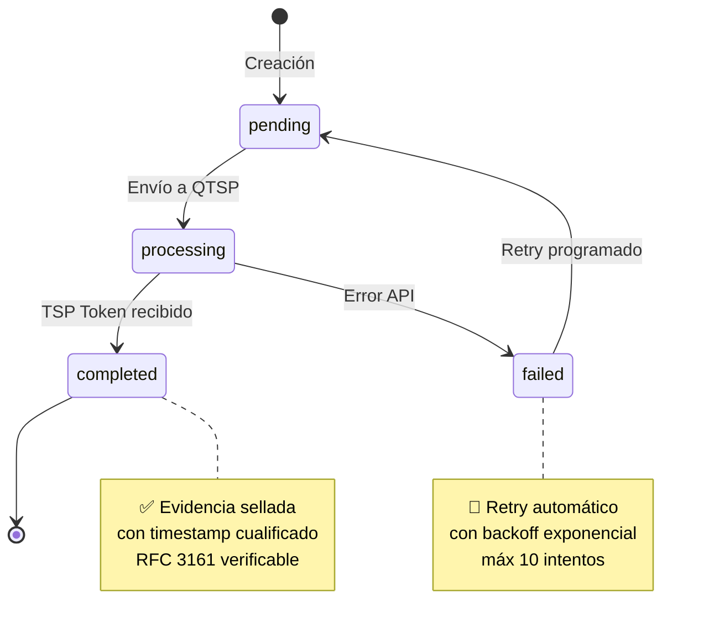

### Secretos QTSP Requeridos

| Secreto | Descripción |
|---------|-------------|
| `DIGITALTRUST_API_URL` | URL base de la API QTSP |
| `DIGITALTRUST_LOGIN_URL` | URL endpoint OAuth 2.0 |
| `DIGITALTRUST_CLIENT_ID` | ID del cliente OAuth |
| `DIGITALTRUST_CLIENT_SECRET` | Secret del cliente OAuth |

---

## 📦 Generador de Paquetes ITSS

### Visión General

El generador de paquetes ITSS permite crear **documentación completa y certificada** para responder a requerimientos de la Inspección de Trabajo y Seguridad Social.

### Wizard de 6 Pasos

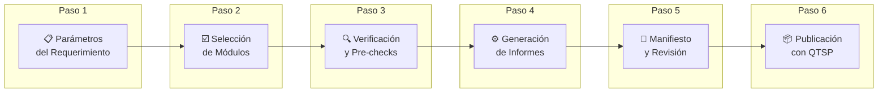

### Estructura del Paquete ZIP

```
paquete_itss_[empresa]_[fecha]/
├── 00_portada_remision.pdf
├── 01_indice_paquete.pdf
├── modulo_1_registro_jornada/
│   ├── registro_diario.csv            # Formato técnico ITSS
│   ├── registro_diario_resumen.pdf     # PDF con totales
│   └── indice_consolidado.pdf          # Por centro
├── modulo_2_calendario/
│   ├── calendario_laboral_2026.pdf     # Festivos + turnos
│   └── calendario_laboral.csv
├── modulo_3_politicas/
│   ├── politica_control_horario.pdf    # Obligatoria
│   └── politica_privacidad.pdf         # RGPD
├── modulo_4_sumarios/
│   ├── sumario_contratos.csv           # Si disponible
│   └── sumario_contraste_nominas.csv
├── modulo_5_evidencias/
│   ├── referencias_qtsp.json           # Tokens TSP
│   └── huellas_integridad.json         # SHA-256
├── anexos/                              # Opcional
│   ├── correcciones_periodo.pdf
│   └── planificado_vs_trabajado.pdf
└── manifest.json                        # Sellado QTSP
```

### Especificación CSV Registro Diario

| Columna | Tipo | Descripción |
|---------|------|-------------|
| `company_id` | UUID | ID empresa |
| `company_name` | Text | Nombre empresa |
| `center_id` | UUID | ID centro trabajo |
| `center_name` | Text | Nombre centro |
| `employee_id` | UUID | ID empleado |
| `employee_name` | Text | Nombre completo |
| `nif` | Text | NIF/NIE empleado |
| `date` | Date | AAAA-MM-DD |
| `entry_time` | Timestamp | HH:MM:SS TZ |
| `exit_time` | Timestamp | HH:MM:SS TZ |
| `daily_worked_minutes` | Integer | Minutos trabajados |
| `event_count` | Integer | Número fichajes |
| `terminal_id` | UUID | Terminal usado |
| `terminal_name` | Text | Nombre terminal |
| `auth_factor` | Enum | QR / PIN / QR+PIN |
| `origin` | Enum | online / offline / contingency |
| `correction_flag` | Boolean | Si tiene corrección |
| `correction_reason` | Text | Motivo corrección |
| `audit_ref` | Text | Hash encadenado |

### Manifiesto JSON

```json
{
  "version": "1.0",
  "company": {
    "id": "uuid",
    "name": "Empresa S.L.",
    "cif": "B12345678"
  },
  "centers": [
    { "id": "uuid", "name": "Oficina Central" }
  ],
  "period": {
    "start": "2025-01-01",
    "end": "2025-12-31"
  },
  "itss_reference": {
    "expedient_id": "12345/2026",
    "request_date": "2026-01-05",
    "contact_person": "Juan García"
  },
  "deliverables": [
    { "name": "registro_diario.csv", "sha256": "abc...", "rows": 12345 },
    { "name": "calendario_laboral.pdf", "sha256": "def..." }
  ],
  "qtsp_evidences": [
    { "date": "2025-01-15", "daily_root_hash": "...", "tsp_token": "..." }
  ],
  "generated_at": "2026-01-06T10:30:00Z",
  "generated_by": { "id": "uuid", "email": "admin@empresa.com" },
  "integrity": {
    "algorithm": "SHA-256",
    "package_hash": "xyz..."
  }
}
```

---

## 📋 Sistema de Plantillas y Convenios

### Estructura de Plantillas

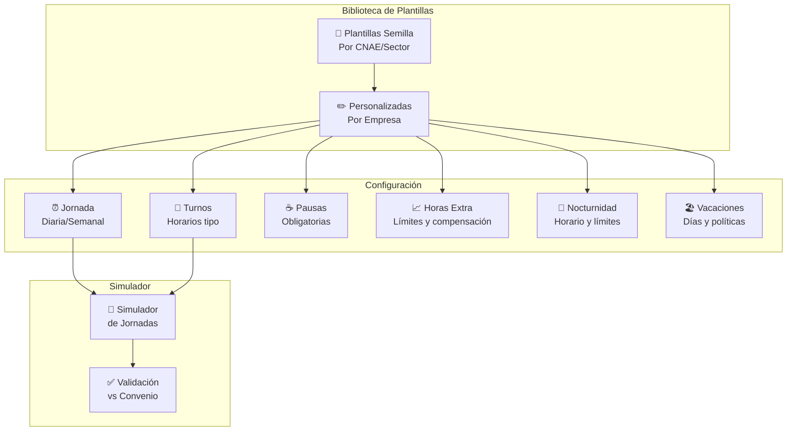

### Wizard de Configuración de Plantilla

| Paso | Nombre | Configuración |
|------|--------|---------------|
| 1 | Convenio | Selección de convenio colectivo base |
| 2 | Jornada | Horas diarias/semanales, tipo jornada |
| 3 | Turnos | Definición de horarios tipo |
| 4 | Pausas | Configuración de descansos obligatorios |
| 5 | Horas Extra | Límites, compensación, bolsa de horas |
| 6 | Nocturnidad | Horario nocturno, límites, plus |
| 7 | Vacaciones | Días base, políticas de solicitud |
| 8 | Notificaciones | Alertas de cumplimiento |
| 9 | Simulación | Prueba con datos de ejemplo |
| 10 | Publicación | Activación y asignación a empleados |

---

## 🏖️ Gestión de Ausencias

### Tipos de Ausencia Configurables

El sistema incluye **25+ tipos de ausencia** basados en el Estatuto de los Trabajadores y convenios:

| Categoría | Tipos | Configuración |
|-----------|-------|---------------|
| **Vacaciones** | Anuales, Adicionales convenio | Días/año, acumulación |
| **Permisos Retribuidos** | Matrimonio, Nacimiento, Fallecimiento, Mudanza, Exámenes | Días fijos, justificante |
| **Permisos No Retribuidos** | Asuntos propios, Excedencia | Límite días/año |
| **IT/Enfermedad** | Enfermedad común, Accidente laboral | Justificante médico |
| **Maternidad/Paternidad** | Nacimiento, Adopción, Lactancia | Duración legal |
| **Formación** | Formación empresa, PIF | Autorización previa |
| **Otros** | Deber público, Fuerza mayor | Justificante específico |

### Workflow de Aprobación

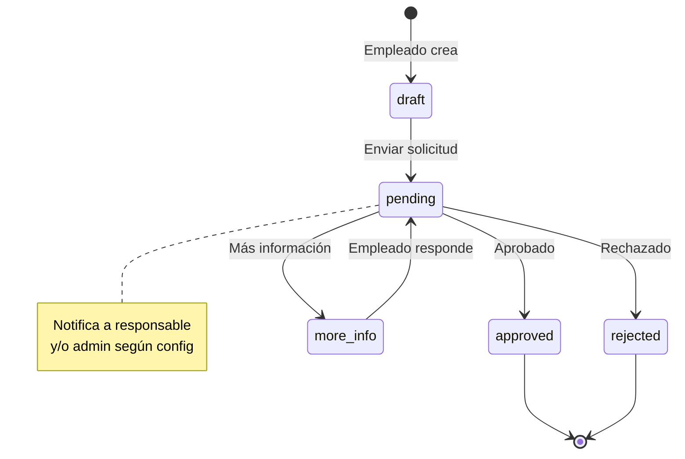

---

## 📅 Calendario Laboral

### Gestión de Calendario

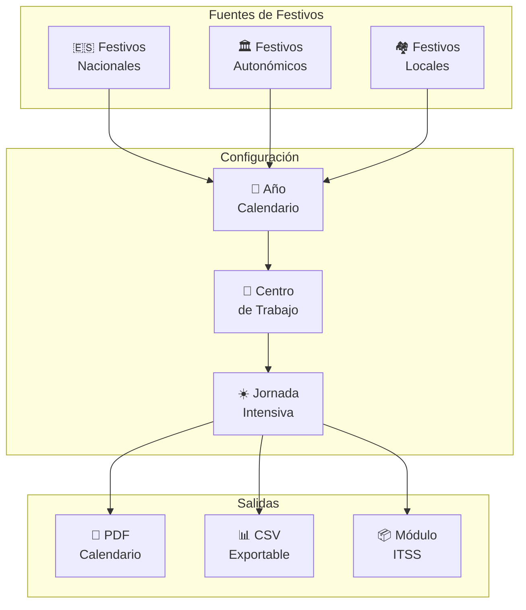

### Estructura del Calendario

```typescript
interface LaborCalendar {
  id: string;
  company_id: string;
  center_id?: string;  // null = todos los centros
  year: number;
  name: string;
  holidays: Holiday[];
  shifts_summary: Shift[];
  intensive_periods: IntensivePeriod[];
  published_at?: string;
}

interface Holiday {
  date: string;  // YYYY-MM-DD
  type: 'nacional' | 'autonomico' | 'local';
  description: string;
}

interface IntensivePeriod {
  start_date: string;
  end_date: string;
  hours_per_day: number;
}
```

---

## 📊 Portal del Asesor Laboral

### Rol del Asesor Laboral

El sistema está diseñado para integrar la función del **asesor laboral externo** como colaborador activo en el cumplimiento:

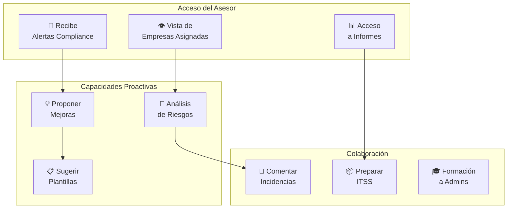

### Funcionalidades del Asesor

| Funcionalidad | Descripción |
|---------------|-------------|
| **Dashboard Proactivo** | Vista de todas las empresas asignadas con indicadores de riesgo |
| **Alertas en Tiempo Real** | Recibe notificaciones de violaciones críticas |
| **Análisis de Riesgos** | Herramientas para identificar patrones de incumplimiento |
| **Propuestas de Mejora** | Puede crear recomendaciones vinculadas a incidencias |
| **Preparación ITSS** | Acceso a generador de paquetes para anticipar inspecciones |
| **Histórico de Cumplimiento** | Acceso a tendencias y evolución por empresa |
| **Simulador de Jornadas** | Prueba de escenarios "what-if" |
| **Documentación** | Acceso a documentos legales y políticas |

### Flujo de Colaboración

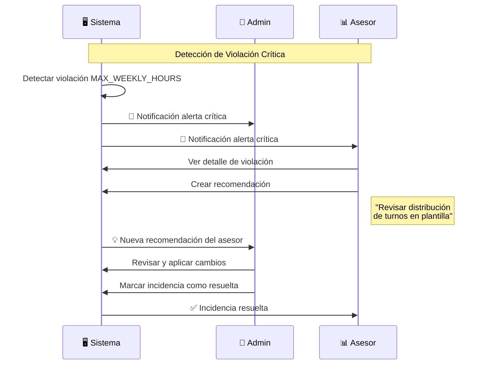

---

## 📄 Documentos Legales

### Plantillas Disponibles (14 Documentos)

| Código | Documento | Categoría | Requiere Aceptación |
|--------|-----------|-----------|:-------------------:|
| `POL_CONTROL_HORARIO` | Política de Control Horario | Política | ✅ |
| `POL_PRIVACIDAD_CONTROL` | Política de Privacidad | RGPD | ✅ |
| `INFO_TRATAMIENTO_DATOS` | Información sobre Tratamiento | RGPD | ✅ |
| `CONSENTIMIENTO_BIOMETRICO` | Consentimiento Biométrico | RGPD | ✅ |
| `ACUERDO_TELETRABAJO` | Acuerdo de Teletrabajo | Laboral | ✅ |
| `MANUAL_FICHAJE` | Manual de Fichaje | Formación | ❌ |
| `POLITICA_AUSENCIAS` | Política de Ausencias | Política | ✅ |
| `CALENDARIO_LABORAL` | Calendario Laboral Anual | Informativo | ❌ |
| `ACUERDO_FLEXIBILIDAD` | Acuerdo de Flexibilidad | Laboral | ✅ |
| `POLITICA_HORAS_EXTRA` | Política de Horas Extra | Política | ✅ |
| `AVISO_LEGAL` | Aviso Legal Aplicación | Legal | ❌ |
| `PROTOCOLO_DESCONEXION` | Protocolo Desconexión Digital | Política | ✅ |
| `POLITICA_VACACIONES` | Política de Vacaciones | Política | ✅ |
| `ACUERDO_REGISTRO_JORNADA` | Acuerdo Colectivo Registro | Laboral | ❌ |

### Flujo de Aceptación con QTSP

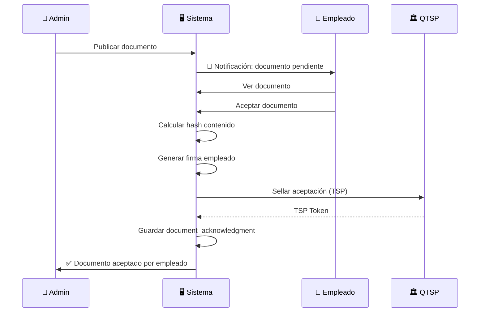

---

## 🔔 Sistema de Notificaciones

### Canales de Notificación

| Canal | Casos de Uso | Certificación |
|-------|--------------|:-------------:|
| **In-App** | Alertas diarias, recordatorios | ❌ |
| **Email** | Incidencias, documentos, resúmenes | Opcional |
| **Email Certificado** | Avisos críticos compliance | ✅ QTSP |
| **SMS** | Alertas urgentes (opcional) | ❌ |
| **SMS Certificado** | Comunicaciones legales | ✅ QTSP |
| **Push (PWA)** | Fichaje exitoso, alertas | ❌ |

### Tipos de Notificación

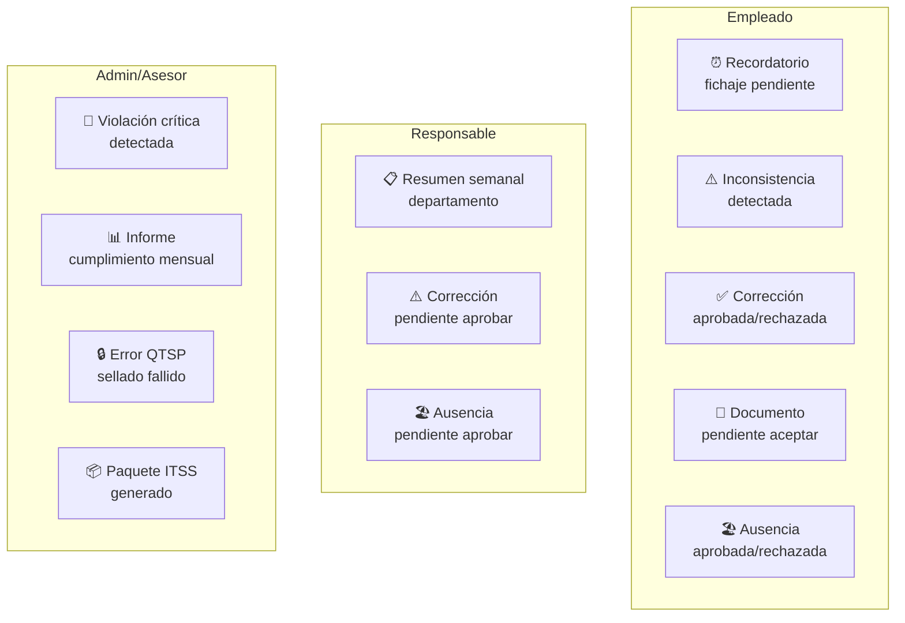

### Edge Functions de Notificación

| Función | Trigger | Destinatario |
|---------|---------|--------------|
| `inconsistency-alert` | Detección en dashboard | Empleado |
| `weekly-inconsistency-summary` | Cron lunes 9:00 | Responsables |
| `escalation-alert` | Nivel escalado | Admin + Asesor |
| `orphan-alert` | Entrada > 12h sin salida | Empleado |
| `notification-dispatcher` | Genérico | Configurable |
| `qtsp-health-alert` | Fallo QTSP | Super Admin |

---

## 📊 Modelo de Datos

### Diagrama Entidad-Relación Principal

```mermaid
erDiagram
    COMPANY ||--o{ EMPLOYEES : "tiene"
    COMPANY ||--o{ TERMINALS : "tiene"
    COMPANY ||--o{ TIME_EVENTS : "registra"
    COMPANY ||--o{ DAILY_ROOTS : "genera"
    COMPANY ||--o{ LABOR_CALENDARS : "configura"
    COMPANY ||--o{ ITSS_PACKAGES : "genera"
    COMPANY ||--o{ COMPLIANCE_VIOLATIONS : "detecta"
    COMPANY ||--o{ ABSENCE_TYPES : "define"
    
    EMPLOYEES ||--o{ TIME_EVENTS : "ficha"
    EMPLOYEES ||--o{ CORRECTION_REQUESTS : "solicita"
    EMPLOYEES ||--o{ ABSENCE_REQUESTS : "solicita"
    EMPLOYEES ||--o{ DOCUMENT_ACKNOWLEDGMENTS : "acepta"
    EMPLOYEES ||--o{ MONTHLY_CLOSURES : "firma"
    EMPLOYEES ||--o{ COMPLIANCE_VIOLATIONS : "genera"
    
    DAILY_ROOTS ||--o{ DT_EVIDENCES : "sella"
    DT_CASE_FILES ||--o{ DT_EVIDENCE_GROUPS : "contiene"
    DT_EVIDENCE_GROUPS ||--o{ DT_EVIDENCES : "agrupa"
    
    LEGAL_DOCUMENT_TEMPLATES ||--o{ LEGAL_DOCUMENTS : "genera"
    LEGAL_DOCUMENTS ||--o{ DOCUMENT_ACKNOWLEDGMENTS : "recibe"
    
    COMPLIANCE_VIOLATIONS ||--o{ COMPLIANCE_INCIDENTS : "crea"
    COMPLIANCE_INCIDENTS ||--o{ COMPLIANCE_NOTIFICATIONS : "dispara"

    COMPANY {
        uuid id PK
        text name
        text cif
        text timezone
        jsonb settings
    }
    
    EMPLOYEES {
        uuid id PK
        uuid company_id FK
        text employee_code
        text first_name
        text last_name
        text department
        boolean is_department_responsible
        enum status
    }
    
    TIME_EVENTS {
        uuid id PK
        uuid employee_id FK
        uuid company_id FK
        enum event_type
        enum event_source
        timestamptz timestamp
        text event_hash
        text previous_hash
    }
    
    COMPLIANCE_VIOLATIONS {
        uuid id PK
        uuid company_id FK
        uuid employee_id FK
        text rule_code
        enum severity
        enum status
        date violation_date
    }
    
    ITSS_PACKAGES {
        uuid id PK
        uuid company_id FK
        date period_start
        date period_end
        text expedient_number
        jsonb components
        jsonb manifest
        text package_hash
        enum status
    }
```

### Tablas Principales

| Tabla | Descripción | RLS |
|-------|-------------|-----|
| `company` | Empresas registradas | Por empresa |
| `employees` | Empleados con credenciales | Por empresa |
| `user_roles` | Roles de usuarios (separado por seguridad) | Por usuario |
| `time_events` | Eventos de fichaje (inmutables) | Por empresa/empleado |
| `daily_roots` | Hash Merkle raíz diario | Por empresa |
| `dt_evidences` | Evidencias selladas QTSP | Por empresa |
| `compliance_violations` | Violaciones detectadas | Por empresa |
| `compliance_incidents` | Incidencias de cumplimiento | Por empresa |
| `labor_calendars` | Calendarios laborales | Por empresa |
| `itss_packages` | Paquetes generados para ITSS | Por empresa |
| `absence_types` | Tipos de ausencia configurables | Por empresa |
| `absence_requests` | Solicitudes de ausencia | Por empresa/empleado |
| `legal_documents` | Documentos legales generados | Por empresa |
| `document_acknowledgments` | Aceptaciones con QTSP | Por empresa |
| `monthly_closures` | Cierres mensuales firmados | Por empresa/empleado |
| `qtsp_audit_log` | Log de operaciones QTSP | Por empresa |
| `escalation_rules` | Reglas de escalado | Por empresa |
| `data_retention_config` | Configuración retención datos | Por empresa |

---

## ⚡ Edge Functions

### Diagrama de Funciones

```mermaid
graph TB
    subgraph "Fichaje"
        KC[kiosk-clock]
        KA[kiosk-auth]
    end

    subgraph "QTSP"
        GDR[generate-daily-root]
        QN[qtsp-notarize]
        QS[qtsp-scheduler]
        QR[qtsp-retry]
        QH[qtsp-health-monitor]
        QE[qtsp-export-package]
    end

    subgraph "Cumplimiento"
        CE[compliance-evaluator]
        GIP[generate-itss-package]
        GLD[generate-legal-document]
        GLR[generate-legal-reports]
    end

    subgraph "Notificaciones"
        IA[inconsistency-alert]
        WIS[weekly-inconsistency-summary]
        EA[escalation-alert]
        OA[orphan-alert]
        ND[notification-dispatcher]
        QHA[qtsp-health-alert]
    end

    subgraph "Utilidades"
        LE[log-export]
        DRP[data-retention-purge]
        TD[templates-diff]
        TP[templates-publish]
        TS[templates-simulate]
        TV[templates-validate]
        VC[vacation-calculator]
    end

    subgraph "Admin"
        STU[setup-test-users]
        STD[setup-test-data]
        AD[acknowledge-document]
        ECP[employee-change-pin]
        SMH[sign-monthly-hours]
    end
```

### Detalle de Funciones Principales

| Función | Propósito | Trigger |
|---------|-----------|---------|
| `kiosk-clock` | Procesa fichajes QR/PIN | HTTP POST kiosk |
| `generate-daily-root` | Calcula Merkle root diario | Scheduler |
| `qtsp-notarize` | Gestiona sellado con QTSP | generate-daily-root |
| `qtsp-scheduler` | Orquesta sellado por timezone | pg_cron cada hora |
| `compliance-evaluator` | Evalúa reglas de cumplimiento | HTTP POST / Cron |
| `generate-itss-package` | Genera paquete completo ITSS | HTTP POST admin |
| `generate-legal-document` | Genera PDFs de documentos | HTTP POST admin |
| `data-retention-purge` | Purga datos > 4 años | pg_cron diario 3:00 AM |
| `inconsistency-alert` | Envía alerta a empleado | HTTP POST dashboard |
| `escalation-alert` | Notifica escalado | Trigger DB |

---

## 📱 Modo Offline (PWA)

### Flujo Offline

```mermaid
sequenceDiagram
    participant USER as 👤 Empleado
    participant KIOSK as 🖥️ Kiosk PWA
    participant SW as ⚙️ Service Worker
    participant IDB as 💾 IndexedDB
    participant API as ☁️ API

    Note over USER,API: Sin conexión
    
    USER->>KIOSK: Escanea QR
    KIOSK->>SW: Verifica conexión
    SW-->>KIOSK: offline
    
    KIOSK->>KIOSK: Validar QR localmente
    KIOSK->>IDB: Guardar evento (cola offline)
    KIOSK-->>USER: ✅ Fichaje guardado offline

    Note over USER,API: Conexión restaurada
    
    SW->>IDB: Obtener cola pendiente
    
    loop Para cada evento
        SW->>API: POST sync_offline
        API-->>SW: ✅ Sincronizado
        SW->>IDB: Eliminar de cola
    end
```

### Características PWA

| Característica | Implementación |
|----------------|----------------|
| **Service Worker** | Vite PWA Plugin |
| **IndexedDB** | Cola encriptada AES-GCM |
| **Detección Red** | Hook `useConnectionStatus` |
| **Sincronización** | Automática al reconectar |
| **Indicador Visual** | `OfflineIndicator` component |

---

## 🔒 Seguridad

### Medidas Implementadas

| Área | Medida |
|------|--------|
| **Autenticación** | Supabase Auth (email/password, magic link) |
| **Autorización** | RLS en todas las tablas |
| **Roles** | Tabla separada `user_roles` (no en profile) |
| **Multi-tenancy** | Aislamiento completo por `company_id` |
| **PINs** | Hash con salt (SHA-256), bloqueo 5 intentos |
| **Inmutabilidad** | `time_events` solo INSERT |
| **Hash Chain** | Cada evento referencia al anterior |
| **Auditoría** | Log completo de acciones |
| **QTSP** | Sellado cualificado eIDAS |
| **Offline** | Encriptación AES-GCM en IndexedDB |
| **Retención** | Purga automática con evidencia QTSP |

### Funciones RLS Helper

```sql
-- Verificar rol de usuario
CREATE FUNCTION has_role(_user_id uuid, _role app_role)
RETURNS boolean
LANGUAGE sql STABLE SECURITY DEFINER
SET search_path = public
AS $$
  SELECT EXISTS (
    SELECT 1 FROM public.user_roles
    WHERE user_id = _user_id AND role = _role
  )
$$;

-- Verificar pertenencia a empresa
CREATE FUNCTION user_belongs_to_company(_user_id uuid, _company_id uuid)
RETURNS boolean
LANGUAGE sql STABLE SECURITY DEFINER
SET search_path = public
AS $$
  SELECT EXISTS (
    SELECT 1 FROM public.user_company
    WHERE user_id = _user_id AND company_id = _company_id
  )
$$;
```

---

## 🛠 Instalación y Configuración

### Requisitos

- Node.js 18+
- Cuenta en Lovable.dev

### Variables de Entorno

```env
# Generadas automáticamente por Lovable Cloud
VITE_SUPABASE_URL=https://xxx.supabase.co
VITE_SUPABASE_PUBLISHABLE_KEY=eyJ...
VITE_SUPABASE_PROJECT_ID=xxx

# Secretos QTSP (configurar en Lovable)
DIGITALTRUST_API_URL=https://api.eadtrust.eu
DIGITALTRUST_LOGIN_URL=https://auth.eadtrust.eu/oauth/token
DIGITALTRUST_CLIENT_ID=your-client-id
DIGITALTRUST_CLIENT_SECRET=your-secret

# Email (opcional)
RESEND_API_KEY=re_xxx
```

### Desarrollo Local

```bash
# Clonar repositorio
git clone <YOUR_GIT_URL>
cd <YOUR_PROJECT_NAME>

# Instalar dependencias
npm install

# Iniciar desarrollo
npm run dev
```

### Configuración de Cron Jobs

```sql
-- Sellado QTSP cada hora
SELECT cron.schedule('qtsp-scheduler-hourly', '0 * * * *', ...);

-- Purga de datos diaria 3:00 AM
SELECT cron.schedule('data-retention-purge', '0 3 * * *', ...);

-- Resumen semanal lunes 9:00 AM
SELECT cron.schedule('weekly-inconsistency-summary', '0 9 * * 1', ...);

-- Evaluación compliance diaria 1:00 AM
SELECT cron.schedule('compliance-evaluator', '0 1 * * *', ...);
```

---

## 📝 Changelog

### v2.0.0 (2026-01-06)
- ✨ **Sistema de Cumplimiento Completo**: Dashboard con semáforo, KPIs, incidencias
- ✨ **Generador Paquetes ITSS**: Wizard 6 pasos, 5 módulos, sellado QTSP
- ✨ **Calendario Laboral**: Gestión festivos, jornada intensiva, multi-centro
- ✨ **Plantillas y Convenios**: Wizard configuración, simulador, versionado
- ✨ **Gestión de Ausencias**: 25+ tipos, workflow aprobación, bloqueo fichaje
- ✨ **Documentos Legales**: 14 plantillas, aceptación con QTSP
- ✨ **Portal Asesor Laboral**: Acceso colaborativo, análisis proactivo
- ✨ **Retención de Datos**: Purga automática 4 años, evidencia QTSP
- ✨ **Escalado de Alertas**: Niveles configurables, notificación asesor
- ✨ **Cierres Mensuales**: Firma empleado con sellado QTSP
- 🗃️ **Nuevas tablas**: labor_calendars, itss_packages, compliance_*, absence_*, etc.

### v1.2.0 (2026-01-06)
- ✨ **Sistema de detección de inconsistencias**
- ✨ **Alertas por email a empleados**
- ✨ **Resumen semanal a responsables**
- ✨ **Panel de configuración notificaciones**

### v1.1.0
- ✨ Integración QTSP con EADTrust
- ✨ Exportación de paquete probatorio
- ✨ Monitoreo de salud QTSP

### v1.0.0
- 🎉 Release inicial
- ✨ Fichaje QR/PIN
- ✨ Gestión de empleados
- ✨ Flujo de correcciones
- ✨ Modo offline PWA

---

## 📞 Contacto

Para soporte técnico o consultas comerciales, contactar al equipo de desarrollo.

---

## 📄 Licencia

Proyecto propietario - Todos los derechos reservados.

---

<p align="center">
  <strong>Time Control Hub</strong><br/>
  Plataforma de Control Horario y Cumplimiento Laboral<br/>
  con Servicios de Confianza Cualificados (QTSP)<br/><br/>
  Desarrollado con ❤️ usando React, Lovable Cloud y Digital Trust
</p>
