# Time Control Hub

[](https://reactjs.org/)
[](https://www.typescriptlang.org/)
[](https://supabase.com/)
[](https://tailwindcss.com/)
[](https://web.dev/progressive-web-apps/)
[](https://digital-strategy.ec.europa.eu/en/policies/eidas-regulation)
[](https://esignature.ec.europa.eu/efda/tl-browser/)

**Plataforma integral de control horario y cumplimiento laboral con sellado de tiempo cualificado (QTSP)** conforme al Reglamento eIDAS, Real Decreto-ley 8/2019 y normativa española de registro de jornada.

> **Time Control Hub opera como Prestador Cualificado de Servicios de Confianza (QTSP)** integrando servicios de firma electrónica cualificada, sellos de tiempo RFC 3161, notificaciones certificadas y custodia de documentos críticos.

---

## Tabla de Contenidos

1. [Visión General](#-visión-general)
2. [Características Principales](#-características-principales)
3. [Arquitectura del Sistema](#-arquitectura-del-sistema)
4. [Roles y Experiencia de Usuario (UX)](#-roles-y-experiencia-de-usuario-ux)
5. [Sistema de Cumplimiento Legal](#-sistema-de-cumplimiento-legal)
6. [Integración QTSP](#-integración-qtsp-qualified-trust-service-provider) | 📄 [Documentación Técnica QTSP](docs/QTSP_INTEGRATION.md)
7. [Generador de Paquetes ITSS](#-generador-de-paquetes-itss)
8. [Sistema de Plantillas y Convenios](#-sistema-de-plantillas-y-convenios)
9. [Gestión de Ausencias](#-gestión-de-ausencias)
10. [Calendario Laboral](#-calendario-laboral)
11. [Portal del Asesor Laboral](#-portal-del-asesor-laboral)
12. [Documentos Legales](#-documentos-legales)
13. [Sistema de Notificaciones](#-sistema-de-notificaciones)
14. [Sistema de Comunicaciones Internas](#-sistema-de-comunicaciones-internas)
15. [Gestión de Dispositivos de Fichaje](#-gestión-de-dispositivos-de-fichaje)
16. [Gestión de Credenciales de Empleados](#-gestión-de-credenciales-de-empleados)
17. [Tests de Integración QTSP](#-tests-de-integración-qtsp)
18. [Modelo de Datos](#-modelo-de-datos)
19. [Edge Functions](#-edge-functions)
20. [Modo Offline (PWA)](#-modo-offline-pwa)
21. [Seguridad](#-seguridad)
22. [Instalación y Configuración](#-instalación-y-configuración)

---

## Visión General

Time Control Hub es una **plataforma empresarial completa** diseñada para:

### Cumplimiento Normativo
- **RD-ley 8/2019**: Registro obligatorio de jornada laboral
- **Reglamento eIDAS**: Servicios de confianza cualificados
- **RGPD/LOPDGDD**: Protección de datos y privacidad
- **Estatuto de los Trabajadores**: Límites de jornada, descansos, horas extra
- **Convenios colectivos**: Configuración específica por sector

### Valor Diferencial
- **Evidencia legal irrefutable**: Sellado QTSP de todos los registros
- **Proactividad en cumplimiento**: Detección automática de violaciones
- **Preparación ante inspección**: Generador de paquetes ITSS completos
- **Colaboración con asesores**: Portal dedicado para asesores laborales

---

## Características Principales

| Módulo | Características |
|--------|-----------------|
| **Control de Fichaje** | QR dinámico, PIN numérico, modo kiosk, offline PWA |
| **Multi-empresa** | Aislamiento RLS, multi-centro, multi-zona horaria |
| **QTSP Integrado** | Firma cualificada, sellos RFC 3161, notificaciones certificadas |
| **Cumplimiento** | Evaluador autom√°tico, sem√°foro de riesgo, alertas proactivas |
| **Generador ITSS** | Paquete completo 6 módulos para Inspección de Trabajo |
| **Calendario Laboral** | Festivos nacionales/autonómicos/locales, jornada intensiva |
| **Plantillas/Convenios** | Configuración por sector, simulador de jornadas |
| **Ausencias** | 25+ tipos de ausencia, workflow aprobación, justificantes |
| **Documentos Legales** | 14 plantillas, aceptación con sellado QTSP |
| **Portal Asesor** | Acceso colaborativo, alertas, an√°lisis de riesgos |
| **Comunicaciones** | Mensajería bidireccional empresa-empleado con trazabilidad |
| **Dispositivos Fichaje** | Panel unificado terminales físicos + kiosks móviles |
| **Credenciales** | Generación y gestión de accesos empleados |
| **Retención de Datos** | Purga automática 4 años, evidencia QTSP previa |
| **Reporting** | PDF sellados, CSV técnico, exportación auditoría |

---

## Arquitectura del Sistema

### Diagrama General

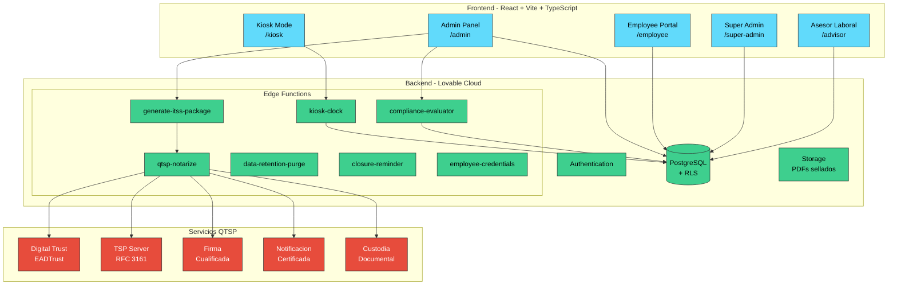
```mermaid
graph TB
    subgraph "Frontend - React + Vite + TypeScript"
        KIOSK["Kiosk Mode\n/kiosk"]
        ADMIN["Admin Panel\n/admin"]
        EMP["Employee Portal\n/employee"]
        SUPER["Super Admin\n/super-admin"]
        ADVISOR["Asesor Laboral\n/advisor"]
    end

    subgraph "Backend - Lovable Cloud"
        AUTH["Authentication"]
        DB[("PostgreSQL\n+ RLS")]
        STORAGE["Storage\nPDFs sellados"]
        
        subgraph "Edge Functions"
            EF1[kiosk-clock]
            EF2[compliance-evaluator]
            EF3[generate-itss-package]
            EF4[qtsp-notarize]
            EF5[data-retention-purge]
            EF6[closure-reminder]
            EF7[employee-credentials]
        end
    end

    subgraph "Servicios QTSP"
        DT["Digital Trust\nEADTrust"]
        TSP["TSP Server\nRFC 3161"]
        SIGN["Firma\nCualificada"]
        NOTIFY["Notificacion\nCertificada"]
        CUSTODY["Custodia\nDocumental"]
    end

    KIOSK --> EF1
    ADMIN --> DB
    ADMIN --> EF2
    ADMIN --> EF3
    EMP --> DB
    SUPER --> DB
    ADVISOR --> DB
    
    EF1 --> DB
    EF2 --> DB
    EF3 --> EF4
    EF4 --> DT
    EF4 --> TSP
    EF4 --> SIGN
    EF4 --> NOTIFY
    EF4 --> CUSTODY

    classDef frontend fill:#61dafb,stroke:#333,color:#000
    classDef backend fill:#3ecf8e,stroke:#333,color:#000
    classDef qtsp fill:#e74c3c,stroke:#333,color:#fff
    
    class KIOSK,ADMIN,EMP,SUPER,ADVISOR frontend
    class AUTH,DB,STORAGE,EF1,EF2,EF3,EF4,EF5,EF6,EF7 backend
    class DT,TSP,SIGN,NOTIFY,CUSTODY qtsp
```

### Stack Tecnológico

| Capa | Tecnología | Propósito |
|------|------------|-----------|
| Frontend | React 18 + Vite + TypeScript | SPA multi-panel responsive |
| UI | shadcn/ui + Tailwind CSS | Design system consistente |
| State | TanStack Query | Cache, sincronización, offline |
| Backend | Lovable Cloud (Supabase) | Auth, DB, Storage, Edge Functions |
| Base de Datos | PostgreSQL + RLS | Multi-tenancy seguro |
| QTSP | EADTrust / Digital Trust | Firma, sellos, custodia |
| Cron | pg_cron + pg_net | Automatizaciones programadas |

---

## Roles y Experiencia de Usuario (UX)

### Jerarquía de Roles

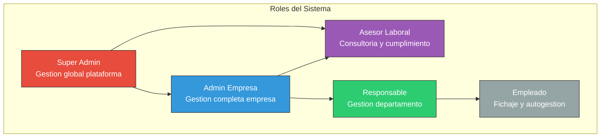
```mermaid
graph TB
    subgraph "Roles del Sistema"
        SA["Super Admin\nGestion global plataforma"]
        AD["Admin Empresa\nGestion completa empresa"]
        AS["Asesor Laboral\nConsultoria y cumplimiento"]
        RE["Responsable\nGestion departamento"]
        EM["Empleado\nFichaje y autogestion"]
    end

    SA --> AD
    SA --> AS
    AD --> RE
    AD --> AS
    RE --> EM

    classDef super fill:#e74c3c,stroke:#333,color:#fff
    classDef admin fill:#3498db,stroke:#333,color:#fff
    classDef advisor fill:#9b59b6,stroke:#333,color:#fff
    classDef resp fill:#2ecc71,stroke:#333,color:#fff
    classDef emp fill:#95a5a6,stroke:#333,color:#fff
    
    class SA super
    class AD admin
    class AS advisor
    class RE resp
    class EM emp
```

### Matriz de Permisos Detallada

| Funcionalidad | Super Admin | Admin | Asesor | Responsable | Empleado |
|---------------|:-----------:|:-----:|:------:|:-----------:|:--------:|
| **Gestión Global** |||||
| Ver todas las empresas | ‚úÖ | ‚ùå | ‚ùå | ‚ùå | ‚ùå |
| Crear/eliminar empresas | ‚úÖ | ‚ùå | ‚ùå | ‚ùå | ‚ùå |
| Monitor QTSP global | ‚úÖ | ‚ùå | ‚ùå | ‚ùå | ‚ùå |
| **Gestión Empresa** |||||
| CRUD empleados | ✅ | ✅ | 👁️ | ❌ | ❌ |
| Gestionar terminales | ‚úÖ | ‚úÖ | ‚ùå | ‚ùå | ‚ùå |
| Configurar plantillas | ‚úÖ | ‚úÖ | üí° | ‚ùå | ‚ùå |
| Gestionar ausencias | ✅ | ✅ | 👁️ | ✅* | ❌ |
| **Cumplimiento** |||||
| Ver dashboard compliance | ✅ | ✅ | ✅ | 👁️* | ❌ |
| Generar paquete ITSS | ‚úÖ | ‚úÖ | ‚úÖ | ‚ùå | ‚ùå |
| Gestionar incidencias | ‚úÖ | ‚úÖ | ‚úÖ | ‚ùå | ‚ùå |
| Configurar reglas | ‚úÖ | ‚úÖ | üí° | ‚ùå | ‚ùå |
| **Documentos** |||||
| Crear documentos legales | ‚úÖ | ‚úÖ | üí° | ‚ùå | ‚ùå |
| Ver evidencias QTSP | ‚úÖ | ‚úÖ | ‚úÖ | ‚ùå | ‚ùå |
| Exportar reportes | ‚úÖ | ‚úÖ | ‚úÖ | ‚úÖ* | ‚úÖ* |
| **Fichajes** |||||
| Ver todos los fichajes | ‚úÖ | ‚úÖ | ‚úÖ | ‚úÖ* | ‚ùå |
| Aprobar correcciones | ‚úÖ | ‚úÖ | ‚ùå | ‚úÖ | ‚ùå |
| Fichar (QR/PIN) | ‚ùå | ‚ùå | ‚ùå | ‚ùå | ‚úÖ |
| Ver fichajes propios | ‚úÖ | ‚úÖ | ‚ùå | ‚úÖ | ‚úÖ |
| Solicitar corrección | ❌ | ❌ | ❌ | ✅ | ✅ |
| **Comunicaciones** |||||
| Enviar mensajes a empleados | ‚úÖ | ‚úÖ | ‚ùå | ‚ùå | ‚ùå |
| Enviar mensajes a empresa | ‚ùå | ‚ùå | ‚ùå | ‚ùå | ‚úÖ |
| Ver historial comunicaciones | ‚úÖ | ‚úÖ | ‚ùå | ‚ùå | ‚úÖ* |

**Leyenda**: ✅ Acceso completo | 👁️ Solo lectura | 💡 Puede sugerir/proponer | ✅* Solo su departamento/propios

---

### Experiencia de Usuario por Rol

#### Empleado - Portal Self-Service

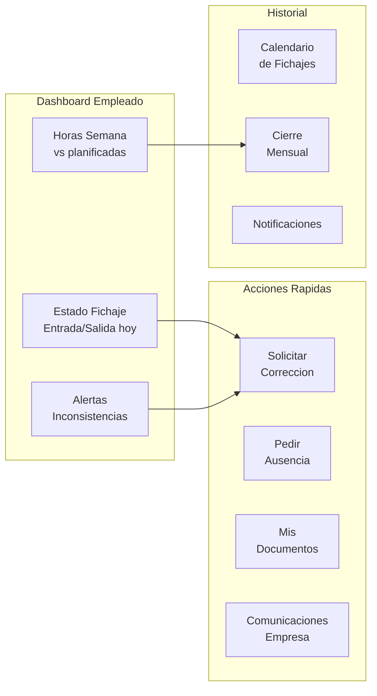
```mermaid
graph LR
    subgraph "Dashboard Empleado"
        CLOCK["Estado Fichaje\nEntrada/Salida hoy"]
        HOURS["Horas Semana\nvs planificadas"]
        ALERTS["Alertas\nInconsistencias"]
    end

    subgraph "Acciones Rapidas"
        CORRECT["Solicitar\nCorreccion"]
        ABSENCE["Pedir\nAusencia"]
        DOCS["Mis\nDocumentos"]
        COMMS["Comunicaciones\nEmpresa"]
    end

    subgraph "Historial"
        CAL["Calendario\nde Fichajes"]
        MONTH["Cierre\nMensual"]
        NOTIFY["Notificaciones"]
    end

    CLOCK --> CORRECT
    HOURS --> MONTH
    ALERTS --> CORRECT
```

**UX Highlights**:
- Dashboard minimalista con estado actual prominente
- Acceso directo a corrección desde alertas
- Calendario visual de fichajes con códigos de color
- Firma digital del cierre mensual
- Notificaciones push de incidencias
- **Comunicaciones bidireccionales con la empresa**
- **Vista unificada de solicitudes (correcciones + ausencias)**

#### Admin - Centro de Control

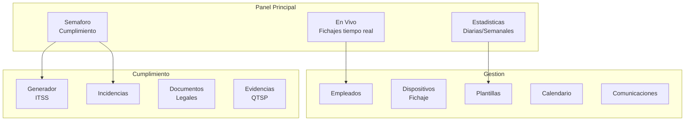
```mermaid
graph TB
    subgraph "Panel Principal"
        LIVE["En Vivo\nFichajes tiempo real"]
        STATS["Estadisticas\nDiarias/Semanales"]
        COMPLIANCE["Semaforo\nCumplimiento"]
    end

    subgraph "Gestion"
        EMP["Empleados"]
        TERM["Dispositivos\nFichaje"]
        TMPL["Plantillas"]
        CAL["Calendario"]
        COMMS["Comunicaciones"]
    end

    subgraph "Cumplimiento"
        ITSS["Generador\nITSS"]
        INCIDENTS["Incidencias"]
        DOCS["Documentos\nLegales"]
        QTSP["Evidencias\nQTSP"]
    end

    LIVE --> EMP
    STATS --> TMPL
    COMPLIANCE --> ITSS
    COMPLIANCE --> INCIDENTS
```

**UX Highlights**:
- Vista en tiempo real de quién está fichado
- Sem√°foro de cumplimiento siempre visible
- Acceso r√°pido a generador ITSS
- Alertas proactivas de violaciones
- Drill-down desde estadísticas a detalle
- **Panel unificado de dispositivos (terminales + kiosks)**
- **Sistema de comunicaciones con empleados**

#### Asesor Laboral - Consultoría Proactiva

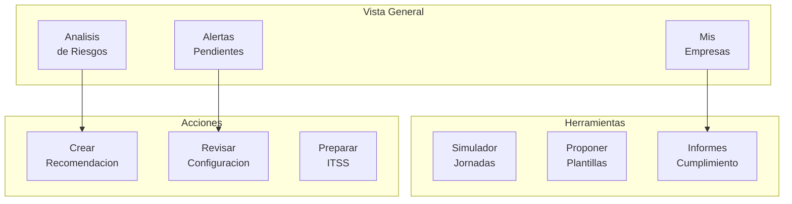
```mermaid
graph TB
    subgraph "Vista General"
        RISK["Analisis\nde Riesgos"]
        COMPANIES["Mis\nEmpresas"]
        ALERTS["Alertas\nPendientes"]
    end

    subgraph "Herramientas"
        SIMULATOR["Simulador\nJornadas"]
        TEMPLATES["Proponer\nPlantillas"]
        REPORTS["Informes\nCumplimiento"]
    end

    subgraph "Acciones"
        RECOMMEND["Crear\nRecomendacion"]
        REVIEW["Revisar\nConfiguracion"]
        ITSS["Preparar\nITSS"]
    end

    RISK --> RECOMMEND
    ALERTS --> REVIEW
    COMPANIES --> REPORTS
```

---

## Sistema de Cumplimiento Legal

### Arquitectura del Evaluador de Cumplimiento

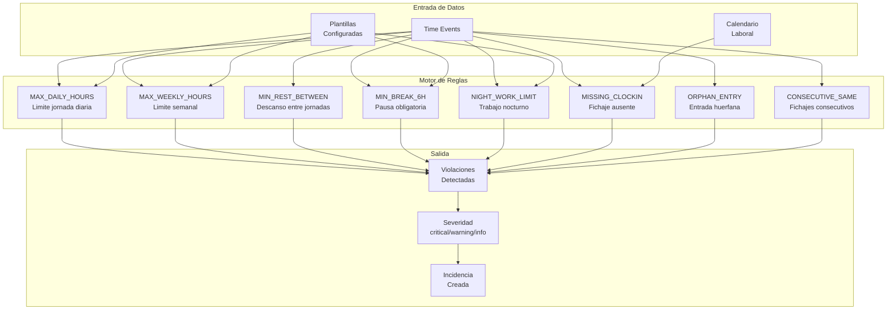
```mermaid
graph TB
    subgraph "Entrada de Datos"
        TE["Time Events"]
        TMPL["Plantillas\nConfiguradas"]
        CAL["Calendario\nLaboral"]
    end

    subgraph "Motor de Reglas"
        R1["MAX_DAILY_HOURS\nLimite jornada diaria"]
        R2["MAX_WEEKLY_HOURS\nLimite semanal"]
        R3["MIN_REST_BETWEEN\nDescanso entre jornadas"]
        R4["MIN_BREAK_6H\nPausa obligatoria"]
        R5["NIGHT_WORK_LIMIT\nTrabajo nocturno"]
        R6["MISSING_CLOCKIN\nFichaje ausente"]
        R7["ORPHAN_ENTRY\nEntrada huerfana"]
        R8["CONSECUTIVE_SAME\nFichajes consecutivos"]
    end

    subgraph "Salida"
        VIOLATIONS["Violaciones\nDetectadas"]
        SEVERITY["Severidad\ncritical/warning/info"]
        INCIDENT["Incidencia\nCreada"]
    end

    TE --> R1
    TE --> R2
    TE --> R3
    TE --> R4
    TE --> R5
    TE --> R6
    TE --> R7
    TE --> R8
    TMPL --> R1
    TMPL --> R2
    TMPL --> R4
    TMPL --> R5
    CAL --> R6

    R1 --> VIOLATIONS
    R2 --> VIOLATIONS
    R3 --> VIOLATIONS
    R4 --> VIOLATIONS
    R5 --> VIOLATIONS
    R6 --> VIOLATIONS
    R7 --> VIOLATIONS
    R8 --> VIOLATIONS
    
    VIOLATIONS --> SEVERITY
    SEVERITY --> INCIDENT
```

### Reglas de Cumplimiento Implementadas

| Código | Nombre | Descripción | Severidad | Base Legal |
|--------|--------|-------------|-----------|------------|
| `MAX_DAILY_HOURS` | Jornada diaria excesiva | > 9h diarias (o límite plantilla) | Critical | ET Art. 34.3 |
| `MAX_WEEKLY_HOURS` | Jornada semanal excesiva | > 40h semanales (o convenio) | Critical | ET Art. 34.1 |
| `MIN_REST_BETWEEN` | Descanso insuficiente | < 12h entre fin e inicio jornada | Critical | ET Art. 34.3 |
| `MIN_BREAK_6H` | Pausa no realizada | Sin pausa de 15min en jornadas > 6h | Warning | ET Art. 34.4 |
| `NIGHT_WORK_LIMIT` | Trabajo nocturno excesivo | > 8h noche o límites convenio | Critical | ET Art. 36 |
| `MISSING_CLOCKIN` | Fichaje ausente | Día laborable sin ningún registro | Warning | RD-ley 8/2019 |
| `ORPHAN_ENTRY` | Entrada huérfana | Entrada sin salida > 12h | Warning | RD-ley 8/2019 |
| `CONSECUTIVE_SAME` | Fichajes consecutivos | Dos entradas/salidas seguidas | Info | RD-ley 8/2019 |
| `OVERTIME_LIMIT` | Horas extra excesivas | > 80h/año de horas extraordinarias | Critical | ET Art. 35.2 |

### Dashboard de Cumplimiento

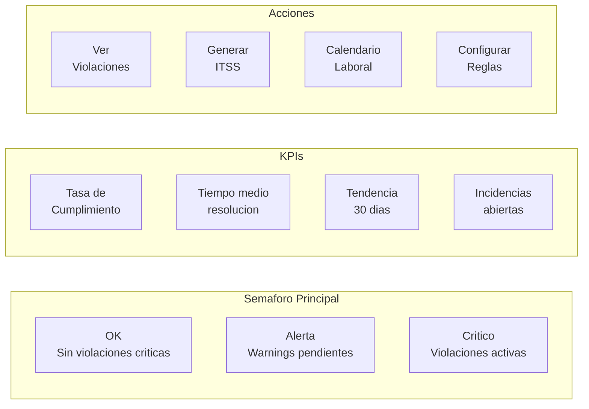
```mermaid
graph LR
    subgraph "Semaforo Principal"
        GREEN["OK\nSin violaciones criticas"]
        YELLOW["Alerta\nWarnings pendientes"]
        RED["Critico\nViolaciones activas"]
    end

    subgraph "KPIs"
        K1["Tasa de\nCumplimiento"]
        K2["Tiempo medio\nresolucion"]
        K3["Tendencia\n30 dias"]
        K4["Incidencias\nabiertas"]
    end

    subgraph "Acciones"
        A1["Ver\nViolaciones"]
        A2["Generar\nITSS"]
        A3["Calendario\nLaboral"]
        A4["Configurar\nReglas"]
    end
```

### Flujo de Gestión de Incidencias

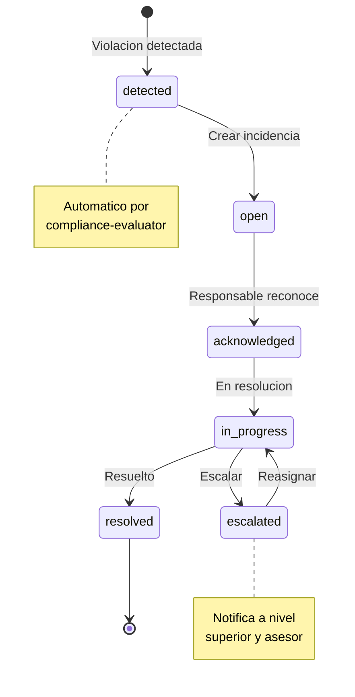
```mermaid
stateDiagram-v2
    [*] --> detected: Violacion detectada
    detected --> open: Crear incidencia
    open --> acknowledged: Responsable reconoce
    acknowledged --> in_progress: En resolucion
    in_progress --> resolved: Resuelto
    in_progress --> escalated: Escalar
    escalated --> in_progress: Reasignar
    resolved --> [*]
    
    note right of detected
        Automatico por
        compliance-evaluator
    end note
    
    note right of escalated
        Notifica a nivel
        superior y asesor
    end note
```

---

## Integración QTSP (Qualified Trust Service Provider)

> 📄 **[Documentación Técnica Completa QTSP](docs/QTSP_INTEGRATION.md)** - API Reference, Flujos, Modelo de Datos, Monitorización y Tests

### Visión como QTSP

Time Control Hub **opera como Prestador Cualificado de Servicios de Confianza** integrando los siguientes servicios vía API:

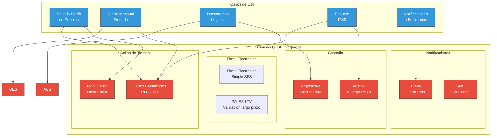
```mermaid
graph TB
    subgraph "Servicios QTSP Integrados"
        subgraph "Firma Electronica"
            SES["Firma Electronica\nSimple SES"]
            PADES["PAdES-LTV\nValidacion largo plazo"]
        end
        
        subgraph "Sellos de Tiempo"
            TSP["Sellos Cualificados\nRFC 3161"]
            MERKLE["Merkle Tree\nHash Chain"]
        end
        
        subgraph "Notificaciones"
            CERT_EMAIL["Email\nCertificado"]
            CERT_SMS["SMS\nCertificado"]
        end
        
        subgraph "Custodia"
            CUSTODY["Repositorio\nDocumental"]
            ARCHIVE["Archivo\na Largo Plazo"]
        end
    end

    subgraph "Casos de Uso"
        DAILY["Sellado Diario\nde Fichajes"]
        MONTHLY["Cierre Mensual\nFirmado"]
        DOCS["Documentos\nLegales"]
        ITSS["Paquete\nITSS"]
        NOTIFY["Notificaciones\na Empleados"]
    end

    DAILY --> TSP
    DAILY --> MERKLE
    MONTHLY --> QES
    MONTHLY --> TSP
    DOCS --> AES
    DOCS --> CUSTODY
    ITSS --> TSP
    ITSS --> ARCHIVE
    NOTIFY --> CERT_EMAIL

    classDef service fill:#e74c3c,stroke:#333,color:#fff
    classDef usecase fill:#3498db,stroke:#333,color:#fff
    
    class QES,AES,TSP,MERKLE,CERT_EMAIL,CERT_SMS,CUSTODY,ARCHIVE service
    class DAILY,MONTHLY,DOCS,ITSS,NOTIFY usecase
```

### Arquitectura de Sellado Diario

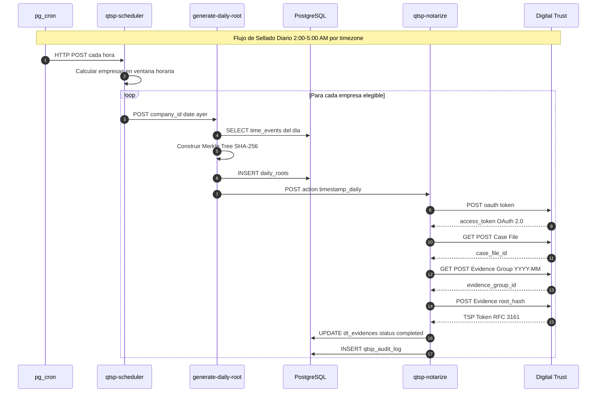
```mermaid
sequenceDiagram
    autonumber
    participant CRON as pg_cron
    participant SCHED as qtsp-scheduler
    participant GEN as generate-daily-root
    participant DB as PostgreSQL
    participant NOTARIZE as qtsp-notarize
    participant DT as Digital Trust

    Note over CRON,DT: Flujo de Sellado Diario 2:00-5:00 AM por timezone
    
    CRON->>SCHED: HTTP POST cada hora
    SCHED->>SCHED: Calcular empresas en ventana horaria
    
    loop Para cada empresa elegible
        SCHED->>GEN: POST company_id date ayer
        GEN->>DB: SELECT time_events del dia
        GEN->>GEN: Construir Merkle Tree SHA-256
        GEN->>DB: INSERT daily_roots
        GEN->>NOTARIZE: POST action timestamp_daily
        
        NOTARIZE->>DT: POST oauth token
        DT-->>NOTARIZE: access_token OAuth 2.0
        
        NOTARIZE->>DT: GET POST Case File
        DT-->>NOTARIZE: case_file_id
        
        NOTARIZE->>DT: GET POST Evidence Group YYYY-MM
        DT-->>NOTARIZE: evidence_group_id
        
        NOTARIZE->>DT: POST Evidence root_hash
        DT-->>NOTARIZE: TSP Token RFC 3161
        
        NOTARIZE->>DB: UPDATE dt_evidences status completed
        NOTARIZE->>DB: INSERT qtsp_audit_log
    end
```

### Algoritmo Hash-Chain y Merkle Tree

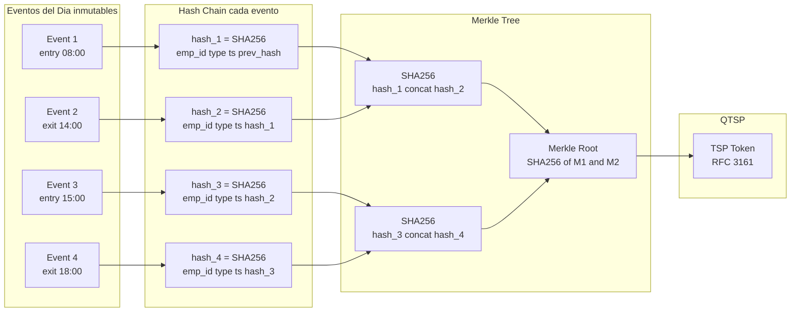
```mermaid
graph LR
    subgraph "Eventos del Dia inmutables"
        E1["Event 1\nentry 08:00"]
        E2["Event 2\nexit 14:00"]
        E3["Event 3\nentry 15:00"]
        E4["Event 4\nexit 18:00"]
    end

    subgraph "Hash Chain cada evento"
        H1["hash_1 = SHA256\nemp_id type ts prev_hash"]
        H2["hash_2 = SHA256\nemp_id type ts hash_1"]
        H3["hash_3 = SHA256\nemp_id type ts hash_2"]
        H4["hash_4 = SHA256\nemp_id type ts hash_3"]
    end

    subgraph "Merkle Tree"
        M1["SHA256\nhash_1 concat hash_2"]
        M2["SHA256\nhash_3 concat hash_4"]
        ROOT["Merkle Root\nSHA256 of M1 and M2"]
    end

    subgraph "QTSP"
        TSP["TSP Token\nRFC 3161"]
    end

    E1 --> H1
    E2 --> H2
    E3 --> H3
    E4 --> H4
    
    H1 --> M1
    H2 --> M1
    H3 --> M2
    H4 --> M2
    M1 --> ROOT
    M2 --> ROOT
    ROOT --> TSP
```

### Servicios QTSP Disponibles

| Servicio | API Endpoint | Uso en Time Control Hub |
|----------|--------------|-------------------------|
| **Firma Simple PAdES-LTV** | `/evidences` | Cierre mensual, informes, documentos |
| **Sello de Tiempo (TSA)** | `/evidences` | Hash diario Merkle, PDFs, paquetes ITSS |
| **Hash Evidence** | `/evidences` | Mensajes, notificaciones, acuses |
| **Email Certificado** | `/notifications/email` | Alertas cumplimiento, incidencias |
| **SMS Certificado** | `/notifications/sms` | Alertas críticas urgentes |
| **Custodia Documental** | `/custody/documents` | Documentos legales, cierres firmados |
| **Verificación** | `/verify` | Validación de firmas y sellos |

> **Nota sobre niveles de firma**: Time Control Hub utiliza **firma simple (SIMPLE)** con un solo factor de autenticación y formato **PAdES-LTV** para validación a largo plazo. Esto cumple con los requisitos del RD-ley 8/2019 para registro de jornada.

### Tabla de Estados de Evidencia

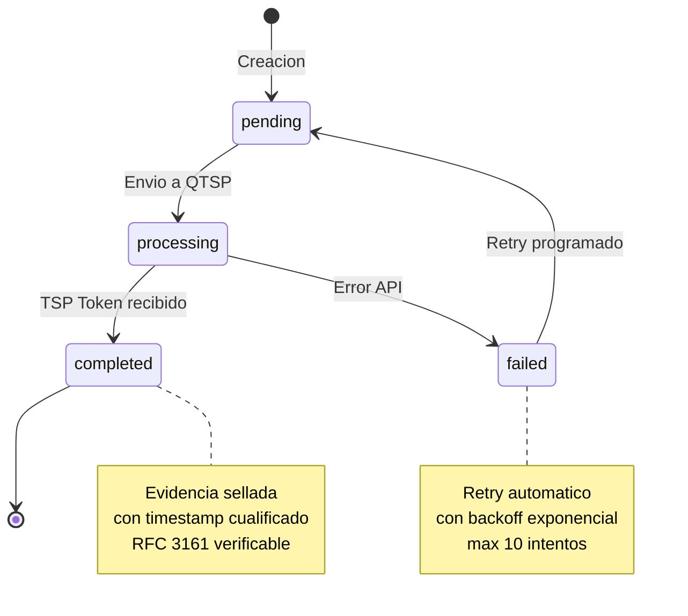
```mermaid
stateDiagram-v2
    [*] --> pending: Creacion
    pending --> processing: Envio a QTSP
    processing --> completed: TSP Token recibido
    processing --> failed: Error API
    failed --> pending: Retry programado
    completed --> [*]
    
    note right of completed
        Evidencia sellada
        con timestamp cualificado
        RFC 3161 verificable
    end note
    
    note right of failed
        Retry automatico
        con backoff exponencial
        max 10 intentos
    end note
```

### Secretos QTSP Requeridos

| Secreto | Descripción |
|---------|-------------|
| `DIGITALTRUST_API_URL` | URL base de la API QTSP |
| `DIGITALTRUST_LOGIN_URL` | URL endpoint OAuth 2.0 |
| `DIGITALTRUST_CLIENT_ID` | ID del cliente OAuth |
| `DIGITALTRUST_CLIENT_SECRET` | Secret del cliente OAuth |

---

## Generador de Paquetes ITSS

### Visión General

El generador de paquetes ITSS permite crear **documentación completa y certificada** para responder a requerimientos de la Inspección de Trabajo y Seguridad Social.

### Wizard de 6 Pasos

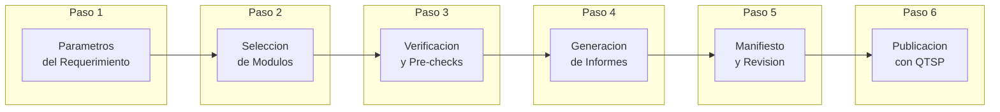
```mermaid
graph LR
    subgraph "Paso 1"
        P1["Parametros\ndel Requerimiento"]
    end
    
    subgraph "Paso 2"
        P2["Seleccion\nde Modulos"]
    end
    
    subgraph "Paso 3"
        P3["Verificacion\ny Pre-checks"]
    end
    
    subgraph "Paso 4"
        P4["Generacion\nde Informes"]
    end
    
    subgraph "Paso 5"
        P5["Manifiesto\ny Revision"]
    end
    
    subgraph "Paso 6"
        P6["Publicacion\ncon QTSP"]
    end

    P1 --> P2 --> P3 --> P4 --> P5 --> P6
```

### Estructura del Paquete ZIP

```
paquete_itss_[empresa]_[fecha]/
├── 00_portada_remision.pdf
├── 01_indice_paquete.pdf
├── modulo_1_registro_jornada/
│   ├── registro_diario.csv            # Formato técnico ITSS
│   ├── registro_diario_resumen.pdf     # PDF con totales
│   └── indice_consolidado.pdf          # Por centro
├── modulo_2_calendario/
│   ├── calendario_laboral_2026.pdf     # Festivos + turnos
│   └── calendario_laboral.csv
├── modulo_3_politicas/
│   ├── politica_control_horario.pdf    # Obligatoria
│   └── politica_privacidad.pdf         # RGPD
├── modulo_4_sumarios/
│   ├── sumario_contratos.csv           # Si disponible
│   └── sumario_contraste_nominas.csv
├── modulo_5_evidencias/
│   ├── referencias_qtsp.json           # Tokens TSP
│   └── huellas_integridad.json         # SHA-256
├── anexos/                              # Opcional
│   ├── correcciones_periodo.pdf
│   └── planificado_vs_trabajado.pdf
└── manifest.json                        # Sellado QTSP
```

### Especificación CSV Registro Diario

| Columna | Tipo | Descripción |
|---------|------|-------------|
| `company_id` | UUID | ID empresa |
| `company_name` | Text | Nombre empresa |
| `center_id` | UUID | ID centro trabajo |
| `center_name` | Text | Nombre centro |
| `employee_id` | UUID | ID empleado |
| `employee_name` | Text | Nombre completo |
| `nif` | Text | NIF/NIE empleado |
| `date` | Date | AAAA-MM-DD |
| `entry_time` | Timestamp | HH:MM:SS TZ |
| `exit_time` | Timestamp | HH:MM:SS TZ |
| `daily_worked_minutes` | Integer | Minutos trabajados |
| `event_count` | Integer | N√∫mero fichajes |
| `terminal_id` | UUID | Terminal usado |
| `terminal_name` | Text | Nombre terminal |
| `auth_factor` | Enum | QR / PIN / QR+PIN |
| `origin` | Enum | online / offline / contingency |
| `correction_flag` | Boolean | Si tiene corrección |
| `correction_reason` | Text | Motivo corrección |
| `audit_ref` | Text | Hash encadenado |

### Manifiesto JSON

```json
{
  "version": "1.0",
  "company": {
    "id": "uuid",
    "name": "Empresa S.L.",
    "cif": "B12345678"
  },
  "centers": [
    { "id": "uuid", "name": "Oficina Central" }
  ],
  "period": {
    "start": "2025-01-01",
    "end": "2025-12-31"
  },
  "itss_reference": {
    "expedient_id": "12345/2026",
    "request_date": "2026-01-05",
    "contact_person": "Juan García"
  },
  "deliverables": [
    { "name": "registro_diario.csv", "sha256": "abc...", "rows": 12345 },
    { "name": "calendario_laboral.pdf", "sha256": "def..." }
  ],
  "qtsp_evidences": [
    { "date": "2025-01-15", "daily_root_hash": "...", "tsp_token": "..." }
  ],
  "generated_at": "2026-01-06T10:30:00Z",
  "generated_by": { "id": "uuid", "email": "admin@empresa.com" },
  "integrity": {
    "algorithm": "SHA-256",
    "package_hash": "xyz..."
  }
}
```

---

## Sistema de Plantillas y Convenios

### Estructura de Plantillas

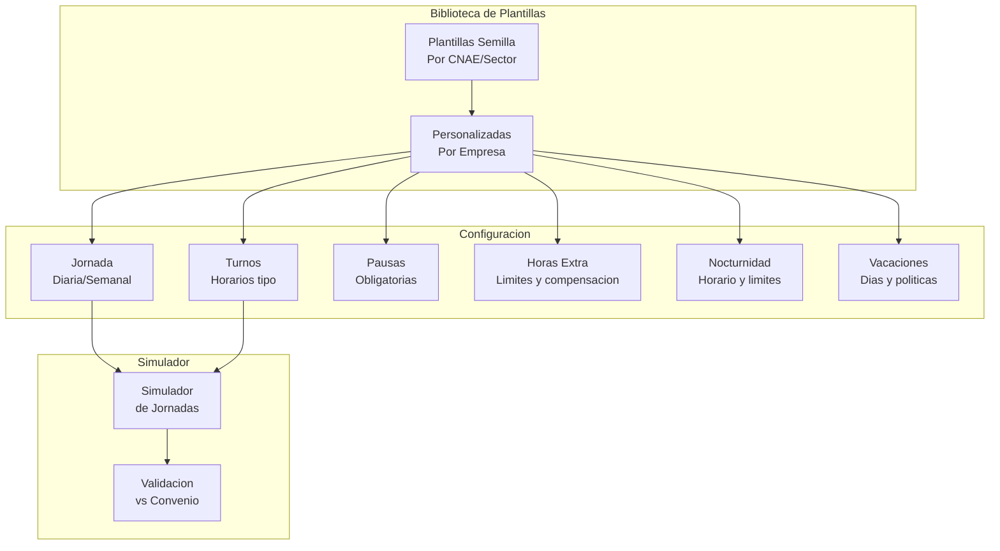
```mermaid
graph TB
    subgraph "Biblioteca de Plantillas"
        SEED["Plantillas Semilla\nPor CNAE/Sector"]
        CUSTOM["Personalizadas\nPor Empresa"]
    end

    subgraph "Configuracion"
        HOURS["Jornada\nDiaria/Semanal"]
        SHIFTS["Turnos\nHorarios tipo"]
        BREAKS["Pausas\nObligatorias"]
        OVERTIME["Horas Extra\nLimites y compensacion"]
        NIGHT["Nocturnidad\nHorario y limites"]
        VACATION["Vacaciones\nDias y politicas"]
    end

    subgraph "Simulador"
        SIM["Simulador\nde Jornadas"]
        VALID["Validacion\nvs Convenio"]
    end

    SEED --> CUSTOM
    CUSTOM --> HOURS
    CUSTOM --> SHIFTS
    CUSTOM --> BREAKS
    CUSTOM --> OVERTIME
    CUSTOM --> NIGHT
    CUSTOM --> VACATION
    
    HOURS --> SIM
    SHIFTS --> SIM
    SIM --> VALID
```

### Wizard de Configuración de Plantilla

| Paso | Nombre | Configuración |
|------|--------|---------------|
| 1 | Convenio | Selección de convenio colectivo base |
| 2 | Jornada | Horas diarias/semanales, tipo jornada |
| 3 | Turnos | Definición de horarios tipo |
| 4 | Pausas | Configuración de descansos obligatorios |
| 5 | Horas Extra | Límites, compensación, bolsa de horas |
| 6 | Nocturnidad | Horario nocturno, límites, plus |
| 7 | Vacaciones | Días base, políticas de solicitud |
| 8 | Notificaciones | Alertas de cumplimiento |
| 9 | Simulación | Prueba con datos de ejemplo |
| 10 | Publicación | Activación y asignación a empleados |

---

## Gestión de Ausencias

### Tipos de Ausencia Configurables

El sistema incluye **25+ tipos de ausencia** basados en el Estatuto de los Trabajadores y convenios:

| Categoría | Tipos | Configuración |
|-----------|-------|---------------|
| **Vacaciones** | Anuales, Adicionales convenio | Días/año, acumulación |
| **Permisos Retribuidos** | Matrimonio, Nacimiento, Fallecimiento, Mudanza, Exámenes | Días fijos, justificante |
| **Permisos No Retribuidos** | Asuntos propios, Excedencia | Límite días/año |
| **IT/Enfermedad** | Enfermedad común, Accidente laboral | Justificante médico |
| **Maternidad/Paternidad** | Nacimiento, Adopción, Lactancia | Duración legal |
| **Formación** | Formación empresa, PIF | Autorización previa |
| **Otros** | Deber público, Fuerza mayor | Justificante específico |

### Workflow de Aprobación

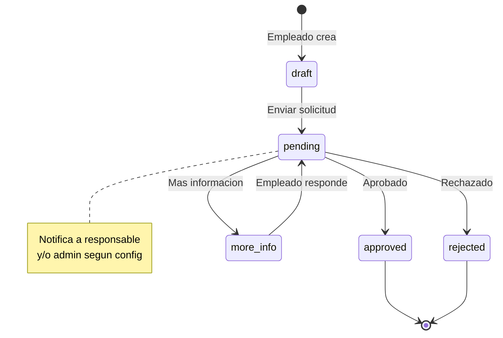
```mermaid
stateDiagram-v2
    [*] --> draft: Empleado crea
    draft --> pending: Enviar solicitud
    pending --> approved: Aprobado
    pending --> rejected: Rechazado
    pending --> more_info: Mas informacion
    more_info --> pending: Empleado responde
    approved --> [*]
    rejected --> [*]
    
    note right of pending
        Notifica a responsable
        y/o admin segun config
    end note
```

### Mejoras Portal Empleado - Ausencias

- **Información normativa**: Al solicitar ausencia, se muestra automáticamente los días que corresponden según el tipo seleccionado
- **Auto-relleno de fechas**: Las fechas se calculan automáticamente según la duración del tipo de ausencia
- **Validación en tiempo real**: Verificación de días disponibles antes de enviar

---

## Calendario Laboral

### Gestión de Calendario

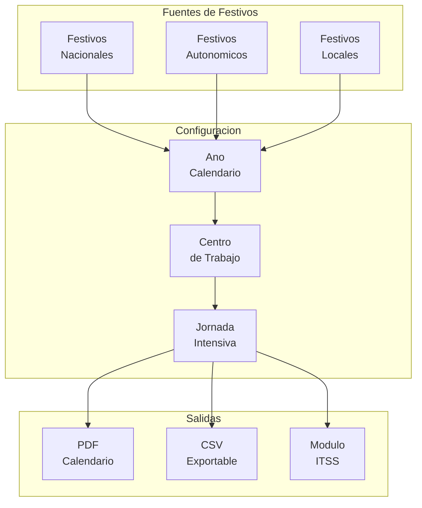
```mermaid
graph TB
    subgraph "Fuentes de Festivos"
        NAC["Festivos\nNacionales"]
        AUTO["Festivos\nAutonomicos"]
        LOCAL["Festivos\nLocales"]
    end

    subgraph "Configuracion"
        YEAR["Ano\nCalendario"]
        CENTER["Centro\nde Trabajo"]
        INTENSIVE["Jornada\nIntensiva"]
    end

    subgraph "Salidas"
        PDF["PDF\nCalendario"]
        CSV["CSV\nExportable"]
        ITSS["Modulo\nITSS"]
    end

    NAC --> YEAR
    AUTO --> YEAR
    LOCAL --> YEAR
    YEAR --> CENTER
    CENTER --> INTENSIVE
    
    INTENSIVE --> PDF
    INTENSIVE --> CSV
    INTENSIVE --> ITSS
```

### Estructura del Calendario

```typescript
interface LaborCalendar {
  id: string;
  company_id: string;
  center_id?: string;  // null = todos los centros
  year: number;
  name: string;
  holidays: Holiday[];
  shifts_summary: Shift[];
  intensive_periods: IntensivePeriod[];
  published_at?: string;
}

interface Holiday {
  date: string;  // YYYY-MM-DD
  type: 'nacional' | 'autonomico' | 'local';
  description: string;
}

interface IntensivePeriod {
  start_date: string;
  end_date: string;
  hours_per_day: number;
}
```

---

## Portal del Asesor Laboral

### Rol del Asesor Laboral

El sistema está diseñado para integrar la función del **asesor laboral externo** como colaborador activo en el cumplimiento:

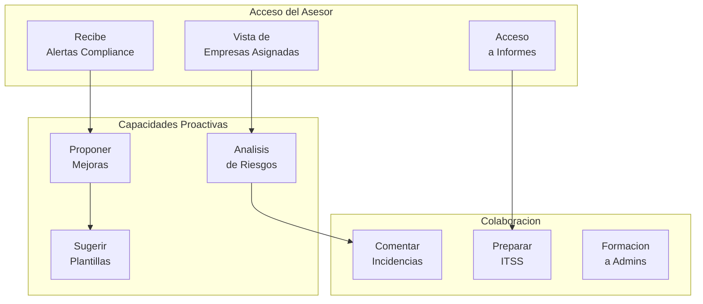
```mermaid
graph TB
    subgraph "Acceso del Asesor"
        VIEW["Vista de\nEmpresas Asignadas"]
        ALERTS["Recibe\nAlertas Compliance"]
        REPORTS["Acceso\na Informes"]
    end

    subgraph "Capacidades Proactivas"
        RISK["Analisis\nde Riesgos"]
        SUGGEST["Proponer\nMejoras"]
        TEMPLATE["Sugerir\nPlantillas"]
    end

    subgraph "Colaboracion"
        COMMENT["Comentar\nIncidencias"]
        PREPARE["Preparar\nITSS"]
        TRAIN["Formacion\na Admins"]
    end

    VIEW --> RISK
    ALERTS --> SUGGEST
    REPORTS --> PREPARE
    
    RISK --> COMMENT
    SUGGEST --> TEMPLATE
```

### Funcionalidades del Asesor

| Funcionalidad | Descripción |
|---------------|-------------|
| **Dashboard Proactivo** | Vista de todas las empresas asignadas con indicadores de riesgo |
| **Alertas en Tiempo Real** | Recibe notificaciones de violaciones críticas |
| **An√°lisis de Riesgos** | Herramientas para identificar patrones de incumplimiento |
| **Propuestas de Mejora** | Puede crear recomendaciones vinculadas a incidencias |
| **Preparación ITSS** | Acceso a generador de paquetes para anticipar inspecciones |
| **Histórico de Cumplimiento** | Acceso a tendencias y evolución por empresa |
| **Simulador de Jornadas** | Prueba de escenarios "what-if" |
| **Documentación** | Acceso a documentos legales y políticas |

### Flujo de Colaboración

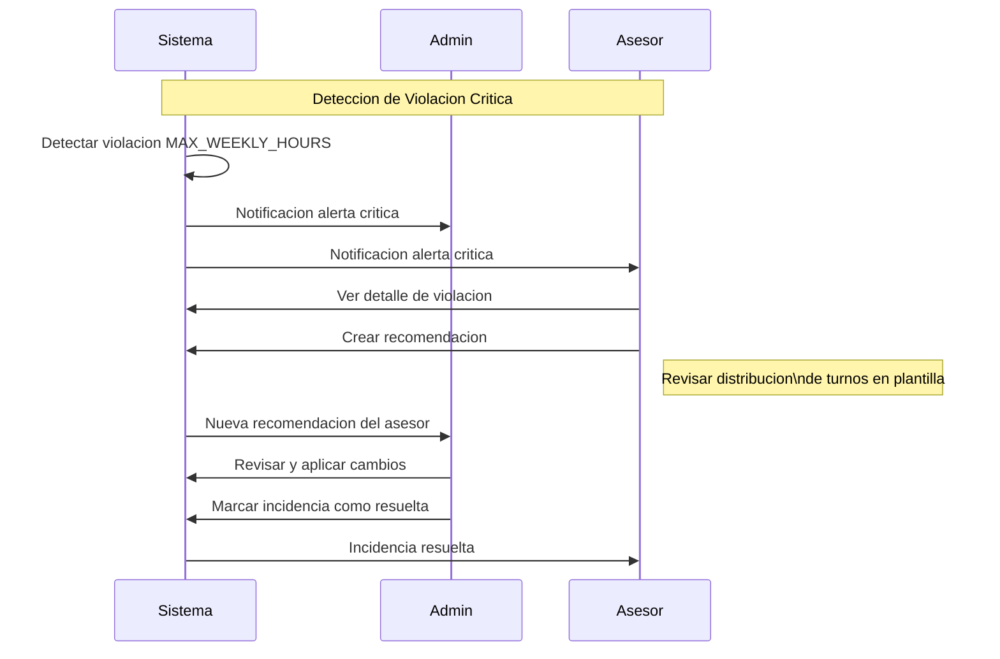
```mermaid
sequenceDiagram
    participant SYS as Sistema
    participant ADMIN as Admin
    participant ASESOR as Asesor

    Note over SYS,ASESOR: Deteccion de Violacion Critica
    
    SYS->>SYS: Detectar violacion MAX_WEEKLY_HOURS
    SYS->>ADMIN: Notificacion alerta critica
    SYS->>ASESOR: Notificacion alerta critica
    
    ASESOR->>SYS: Ver detalle de violacion
    ASESOR->>SYS: Crear recomendacion
    Note right of ASESOR: Revisar distribucion\nde turnos en plantilla
    
    SYS->>ADMIN: Nueva recomendacion del asesor
    ADMIN->>SYS: Revisar y aplicar cambios
    ADMIN->>SYS: Marcar incidencia como resuelta
    
    SYS->>ASESOR: Incidencia resuelta
```

---

## Documentos Legales

### Plantillas Disponibles (14 Documentos)

| Código | Documento | Categoría | Requiere Aceptación |
|--------|-----------|-----------|:-------------------:|
| `POL_CONTROL_HORARIO` | Política de Control Horario | Política | ✅ |
| `POL_PRIVACIDAD_CONTROL` | Política de Privacidad | RGPD | ✅ |
| `INFO_TRATAMIENTO_DATOS` | Información sobre Tratamiento | RGPD | ✅ |
| `CONSENTIMIENTO_BIOMETRICO` | Consentimiento Biométrico | RGPD | ✅ |
| `ACUERDO_TELETRABAJO` | Acuerdo de Teletrabajo | Laboral | ‚úÖ |
| `MANUAL_FICHAJE` | Manual de Fichaje | Formación | ❌ |
| `POLITICA_AUSENCIAS` | Política de Ausencias | Política | ✅ |
| `CALENDARIO_LABORAL` | Calendario Laboral Anual | Informativo | ‚ùå |
| `ACUERDO_FLEXIBILIDAD` | Acuerdo de Flexibilidad | Laboral | ‚úÖ |
| `POLITICA_HORAS_EXTRA` | Política de Horas Extra | Política | ✅ |
| `AVISO_LEGAL` | Aviso Legal Aplicación | Legal | ❌ |
| `PROTOCOLO_DESCONEXION` | Protocolo Desconexión Digital | Política | ✅ |
| `POLITICA_VACACIONES` | Política de Vacaciones | Política | ✅ |
| `ACUERDO_REGISTRO_JORNADA` | Acuerdo Colectivo Registro | Laboral | ‚ùå |

### Flujo de Aceptación con QTSP

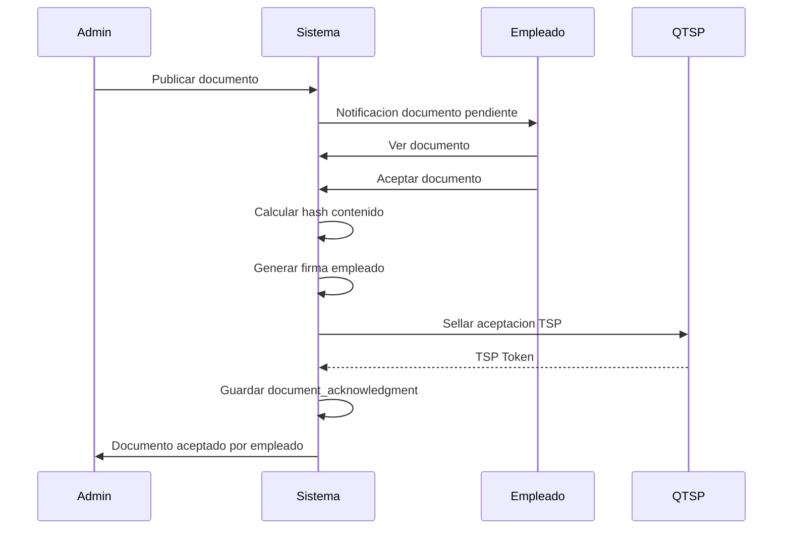
```mermaid
sequenceDiagram
    participant ADMIN as Admin
    participant SYS as Sistema
    participant EMP as Empleado
    participant QTSP as QTSP

    ADMIN->>SYS: Publicar documento
    SYS->>EMP: Notificacion documento pendiente
    
    EMP->>SYS: Ver documento
    EMP->>SYS: Aceptar documento
    
    SYS->>SYS: Calcular hash contenido
    SYS->>SYS: Generar firma empleado
    SYS->>QTSP: Sellar aceptacion TSP
    QTSP-->>SYS: TSP Token
    
    SYS->>SYS: Guardar document_acknowledgment
    SYS->>ADMIN: Documento aceptado por empleado
```

---

## Sistema de Notificaciones

### Canales de Notificación

| Canal | Casos de Uso | Certificación |
|-------|--------------|:-------------:|
| **In-App** | Alertas diarias, recordatorios | ‚ùå |
| **Email** | Incidencias, documentos, res√∫menes | Opcional |
| **Email Certificado** | Avisos críticos compliance | ✅ QTSP |
| **SMS** | Alertas urgentes (opcional) | ‚ùå |
| **SMS Certificado** | Comunicaciones legales | ‚úÖ QTSP |
| **Push (PWA)** | Fichaje exitoso, alertas | ‚ùå |

### Tipos de Notificación

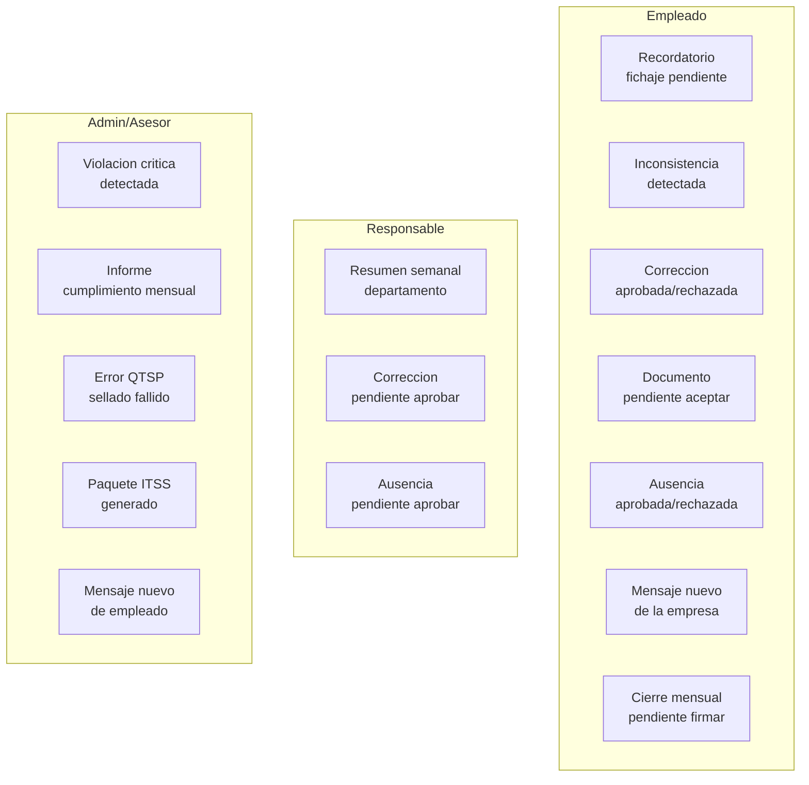
```mermaid
graph TB
    subgraph "Empleado"
        N1["Recordatorio\nfichaje pendiente"]
        N2["Inconsistencia\ndetectada"]
        N3["Correccion\naprobada/rechazada"]
        N4["Documento\npendiente aceptar"]
        N5["Ausencia\naprobada/rechazada"]
        N6["Mensaje nuevo\nde la empresa"]
        N7["Cierre mensual\npendiente firmar"]
    end

    subgraph "Responsable"
        N8["Resumen semanal\ndepartamento"]
        N9["Correccion\npendiente aprobar"]
        N10["Ausencia\npendiente aprobar"]
    end

    subgraph "Admin/Asesor"
        N11["Violacion critica\ndetectada"]
        N12["Informe\ncumplimiento mensual"]
        N13["Error QTSP\nsellado fallido"]
        N14["Paquete ITSS\ngenerado"]
        N15["Mensaje nuevo\nde empleado"]
    end
```

### Edge Functions de Notificación

| Función | Trigger | Destinatario |
|---------|---------|--------------|
| `inconsistency-alert` | Detección en dashboard | Empleado |
| `weekly-inconsistency-summary` | Cron lunes 9:00 | Responsables |
| `escalation-alert` | Nivel escalado | Admin + Asesor |
| `orphan-alert` | Entrada > 12h sin salida | Empleado |
| `notification-dispatcher` | Genérico | Configurable |
| `qtsp-health-alert` | Fallo QTSP | Super Admin |
| `closure-reminder` | Día 3-6 del mes | Empleados sin cierre firmado |

---

## Sistema de Comunicaciones Internas

### Visión General

Sistema de **mensajería bidireccional** entre empresa y empleados con **trazabilidad completa** para evidencia laboral. Permite dejar constancia de todas las comunicaciones oficiales.

### Características Principales

| Característica | Descripción |
|----------------|-------------|
| **Mensajes Bidireccionales** | Empresa ‚Üí Empleado y Empleado ‚Üí Empresa |
| **Destinatarios M√∫ltiples** | Individual, por departamento, o todos los empleados |
| **Prioridades** | Normal, Alta, Urgente |
| **Confirmación de Lectura** | Opción de requerir acuse de recibo |
| **Hilos de Conversación** | Respuestas en el mismo hilo |
| **Adjuntos** | Posibilidad de adjuntar documentos |
| **Trazabilidad Completa** | Timestamps inmutables de envío/lectura/confirmación |

### Flujo de Comunicación

```mermaid
sequenceDiagram
    participant ADMIN as Admin
    participant DB as Base de Datos
    participant NOTIF as Sistema Notificaciones
    participant EMP as Empleado

    ADMIN->>DB: Crear mensaje masivo o individual
    DB->>DB: Guardar en company_messages
    DB->>DB: Crear message_recipients
    DB->>NOTIF: Trigger notificacion
    NOTIF->>EMP: Nueva notificacion
    EMP->>DB: Leer mensaje
    DB->>DB: Registrar read_at
    EMP->>DB: Confirmar lectura
    DB->>DB: Registrar acknowledged_at
    ADMIN->>DB: Consultar estado
    DB->>ADMIN: Lista con estados lectura y confirmacion
```

### Panel Administrador - Comunicaciones

**Ubicación**: `/admin/communications`

- **Bandeja de entrada**: Mensajes recibidos de empleados
- **Redactar mensaje**: 
  - Seleccionar destinatario(s): individual, departamento, todos
  - Asunto y cuerpo del mensaje
  - Prioridad: normal, alta, urgente
  - Opción "Requiere confirmación de lectura"
- **Mensajes enviados**: Historial con estado de entrega/lectura
- **Exportar**: PDF para evidencia legal

### Portal Empleado - Comunicaciones

**Ubicación**: `/employee/communications`

- **Bandeja de entrada**: Mensajes de la empresa con destacado de urgentes
- **Mis mensajes enviados**: Historial de comunicaciones
- **Redactar**: Enviar consultas a la empresa
- **Acciones**: Marcar como leído, confirmar lectura cuando requerido

### Tablas de Base de Datos

| Tabla | Descripción |
|-------|-------------|
| `company_messages` | Mensajes con sender_type, recipient_type, prioridad, thread_id |
| `message_recipients` | Para mensajes masivos: employee_id, read_at, acknowledged_at |

---

## Gestión de Dispositivos de Fichaje

### Panel Unificado

Panel consolidado para gestionar todos los dispositivos de fichaje de la empresa:

```mermaid
graph TB
    subgraph "Dispositivos de Fichaje"
        subgraph "Terminales Fisicos"
            T1["Terminal Oficina\nQR + PIN"]
            T2["Terminal Almacen\nQR"]
        end
        
        subgraph "Kiosks Moviles"
            K1["Tablet Recepcion\nSesion activa"]
            K2["Movil Supervisor\nSesion activa"]
        end
    end

    subgraph "Gestion"
        PAIR["Codigo de\nEmparejamiento"]
        STATUS["Estados\nactivo/inactivo"]
        REVOKE["Revocar\nSesion"]
    end

    T1 --> STATUS
    T2 --> STATUS
    K1 --> REVOKE
    K2 --> REVOKE
```

### Funcionalidades

| Funcionalidad | Descripción |
|---------------|-------------|
| **Terminales Físicos** | Dispositivos fijos en centros de trabajo |
| **Kiosks Móviles** | Sesiones PWA en tablets/móviles |
| **Código de Emparejamiento** | Generación temporal para vincular dispositivos |
| **Estados** | Pendiente, Activo, Inactivo |
| **Última Actividad** | Timestamp de última conexión |
| **Gestión de Sesiones** | Activar/desactivar/revocar sesiones |

### Ubicación

**Panel Admin**: `/admin/kiosk-devices` - Vista unificada de terminales y kiosks

---

## Gestión de Credenciales de Empleados

### Visión General

Sistema para generar y gestionar credenciales de acceso (email/contraseña) para empleados, permitiéndoles acceder al portal de empleado.

### Funcionalidades

| Funcionalidad | Descripción |
|---------------|-------------|
| **Generación de Credenciales** | Crear usuario con email y contraseña temporal |
| **Vinculación Automática** | Enlace con Supabase Auth y tabla employees |
| **Reset de Contraseña** | Administrador puede resetear contraseña |
| **Cambio de PIN** | Empleado puede cambiar su PIN de fichaje |
| **Estado de Credenciales** | Visualizar si empleado tiene usuario vinculado |

### Edge Functions

| Función | Propósito |
|---------|-----------|
| `employee-credentials` | Crear/gestionar credenciales de acceso |
| `employee-change-pin` | Cambiar PIN de fichaje del empleado |

### Flujo de Generación

```mermaid
sequenceDiagram
    participant ADMIN as Admin
    participant EF as employee-credentials
    participant AUTH as Supabase Auth
    participant DB as Base de Datos

    ADMIN->>EF: Generar credenciales para empleado
    EF->>AUTH: Crear usuario con email
    AUTH-->>EF: user_id
    EF->>DB: UPDATE employees SET user_id
    EF-->>ADMIN: Credenciales generadas
    Note right of ADMIN: Email y contraseña\ntemporal mostrados
```

---

## Modelo de Datos

### Diagrama Entidad-Relación Principal

```mermaid
erDiagram
    COMPANY ||--o{ EMPLOYEES : "tiene"
    COMPANY ||--o{ TERMINALS : "tiene"
    COMPANY ||--o{ TIME_EVENTS : "registra"
    COMPANY ||--o{ DAILY_ROOTS : "genera"
    COMPANY ||--o{ LABOR_CALENDARS : "configura"
    COMPANY ||--o{ ITSS_PACKAGES : "genera"
    COMPANY ||--o{ COMPLIANCE_VIOLATIONS : "detecta"
    COMPANY ||--o{ ABSENCE_TYPES : "define"
    COMPANY ||--o{ COMPANY_MESSAGES : "envia"
    
    EMPLOYEES ||--o{ TIME_EVENTS : "ficha"
    EMPLOYEES ||--o{ CORRECTION_REQUESTS : "solicita"
    EMPLOYEES ||--o{ ABSENCE_REQUESTS : "solicita"
    EMPLOYEES ||--o{ DOCUMENT_ACKNOWLEDGMENTS : "acepta"
    EMPLOYEES ||--o{ MONTHLY_CLOSURES : "firma"
    EMPLOYEES ||--o{ COMPLIANCE_VIOLATIONS : "genera"
    EMPLOYEES ||--o{ COMPANY_MESSAGES : "envia/recibe"
    EMPLOYEES ||--o{ MESSAGE_RECIPIENTS : "recibe"
    
    COMPANY_MESSAGES ||--o{ MESSAGE_RECIPIENTS : "tiene"
    
    DAILY_ROOTS ||--o{ DT_EVIDENCES : "sella"
    DT_CASE_FILES ||--o{ DT_EVIDENCE_GROUPS : "contiene"
    DT_EVIDENCE_GROUPS ||--o{ DT_EVIDENCES : "agrupa"
    
    LEGAL_DOCUMENT_TEMPLATES ||--o{ LEGAL_DOCUMENTS : "genera"
    LEGAL_DOCUMENTS ||--o{ DOCUMENT_ACKNOWLEDGMENTS : "recibe"
    
    COMPLIANCE_VIOLATIONS ||--o{ COMPLIANCE_INCIDENTS : "crea"
    COMPLIANCE_INCIDENTS ||--o{ COMPLIANCE_NOTIFICATIONS : "dispara"

    COMPANY {
        uuid id PK
        text name
        text cif
        text timezone
        jsonb settings
    }
    
    EMPLOYEES {
        uuid id PK
        uuid company_id FK
        uuid user_id FK
        text employee_code
        text first_name
        text last_name
        text department
        boolean is_department_responsible
        enum status
    }
    
    TIME_EVENTS {
        uuid id PK
        uuid employee_id FK
        uuid company_id FK
        enum event_type
        enum event_source
        timestamptz timestamp
        text event_hash
        text previous_hash
    }
    
    COMPANY_MESSAGES {
        uuid id PK
        uuid company_id FK
        uuid thread_id FK
        enum sender_type
        uuid sender_employee_id FK
        enum recipient_type
        uuid recipient_employee_id FK
        text subject
        text body
        enum priority
        boolean requires_acknowledgment
    }
    
    MESSAGE_RECIPIENTS {
        uuid id PK
        uuid message_id FK
        uuid employee_id FK
        timestamptz read_at
        timestamptz acknowledged_at
    }
    
    COMPLIANCE_VIOLATIONS {
        uuid id PK
        uuid company_id FK
        uuid employee_id FK
        text rule_code
        enum severity
        enum status
        date violation_date
    }
    
    ITSS_PACKAGES {
        uuid id PK
        uuid company_id FK
        date period_start
        date period_end
        text expedient_number
        jsonb components
        jsonb manifest
        text package_hash
        enum status
    }
```

### Tablas Principales

| Tabla | Descripción | RLS |
|-------|-------------|-----|
| `company` | Empresas registradas | Por empresa |
| `employees` | Empleados con credenciales | Por empresa |
| `user_roles` | Roles de usuarios (separado por seguridad) | Por usuario |
| `time_events` | Eventos de fichaje (inmutables) | Por empresa/empleado |
| `daily_roots` | Hash Merkle raíz diario | Por empresa |
| `dt_evidences` | Evidencias selladas QTSP | Por empresa |
| `compliance_violations` | Violaciones detectadas | Por empresa |
| `compliance_incidents` | Incidencias de cumplimiento | Por empresa |
| `labor_calendars` | Calendarios laborales | Por empresa |
| `itss_packages` | Paquetes generados para ITSS | Por empresa |
| `absence_types` | Tipos de ausencia configurables | Por empresa |
| `absence_requests` | Solicitudes de ausencia | Por empresa/empleado |
| `legal_documents` | Documentos legales generados | Por empresa |
| `document_acknowledgments` | Aceptaciones con QTSP | Por empresa |
| `monthly_closures` | Cierres mensuales firmados | Por empresa/empleado |
| `company_messages` | Mensajes empresa-empleado | Por empresa |
| `message_recipients` | Destinatarios de mensajes masivos | Por empresa/empleado |
| `kiosk_sessions` | Sesiones de kiosk móvil | Por empresa |
| `qtsp_audit_log` | Log de operaciones QTSP | Por empresa |
| `escalation_rules` | Reglas de escalado | Por empresa |
| `data_retention_config` | Configuración retención datos | Por empresa |

---

## Edge Functions

### Diagrama de Funciones

```mermaid
graph TB
    subgraph "Fichaje"
        KC[kiosk-clock]
        KA[kiosk-auth]
    end

    subgraph "QTSP"
        GDR[generate-daily-root]
        QN[qtsp-notarize]
        QS[qtsp-scheduler]
        QR[qtsp-retry]
        QH[qtsp-health-monitor]
        QE[qtsp-export-package]
        QTA[qtsp-toggle-alerts]
    end

    subgraph "Cumplimiento"
        CE[compliance-evaluator]
        GIP[generate-itss-package]
        GLD[generate-legal-document]
        GLR[generate-legal-reports]
    end

    subgraph "Notificaciones"
        IA[inconsistency-alert]
        WIS[weekly-inconsistency-summary]
        EA[escalation-alert]
        OA[orphan-alert]
        ND[notification-dispatcher]
        QHA[qtsp-health-alert]
        CR[closure-reminder]
    end

    subgraph "Empleados"
        EC[employee-credentials]
        ECP[employee-change-pin]
        AD[acknowledge-document]
        SMH[sign-monthly-hours]
    end

    subgraph "Utilidades"
        LE[log-export]
        DRP[data-retention-purge]
        TD[templates-diff]
        TP[templates-publish]
        TS[templates-simulate]
        TV[templates-validate]
        VC[vacation-calculator]
    end

    subgraph "Admin"
        STU[setup-test-users]
        STD[setup-test-data]
    end
```

### Detalle de Funciones Principales

| Función | Propósito | Trigger |
|---------|-----------|---------|
| `kiosk-clock` | Procesa fichajes QR/PIN | HTTP POST kiosk |
| `kiosk-auth` | Autentica sesiones de kiosk | HTTP POST |
| `generate-daily-root` | Calcula Merkle root diario | Scheduler |
| `qtsp-notarize` | Gestiona sellado con QTSP | generate-daily-root |
| `qtsp-scheduler` | Orquesta sellado por timezone | pg_cron cada hora |
| `compliance-evaluator` | Eval√∫a reglas de cumplimiento | HTTP POST / Cron |
| `generate-itss-package` | Genera paquete completo ITSS | HTTP POST admin |
| `generate-legal-document` | Genera PDFs de documentos | HTTP POST admin |
| `data-retention-purge` | Purga datos > 4 años | pg_cron diario 3:00 AM |
| `inconsistency-alert` | Envía alerta a empleado | HTTP POST dashboard |
| `escalation-alert` | Notifica escalado | Trigger DB |
| `closure-reminder` | Recordatorio cierre mensual | pg_cron día 3-6 mes |
| `employee-credentials` | Genera credenciales empleado | HTTP POST admin |
| `employee-change-pin` | Cambia PIN de fichaje | HTTP POST empleado |

---

## Tests de Integración QTSP

### Panel de Tests en Vivo

**Ubicación**: `/super-admin/qtsp` → Tab "Tests"

El sistema incluye un panel completo para ejecutar tests de integración contra la API QTSP en tiempo real.

### Tests Disponibles

| Test | Descripción | Validaciones |
|------|-------------|--------------|
| `health_check` | Verificar conectividad | Auth OK, API OK, Latencia |
| `timestamp_daily` | Sellado hash Merkle | Token TSP generado |
| `timestamp_notification` | Sellado notificación | Evidence ID, test_mode |
| `seal_pdf` | Firma PAdES-LTV | SIMPLE, factor=1, EADTRUST |
| `check_status` | Verificar estado | Status actualizado |

### Validaciones de Firma

```typescript
// Configuración de firma validada
{
  provider: 'EADTRUST',
  type: 'PADES_LTV',
  level: 'SIMPLE',        // Firma simple
  authenticationFactor: 1  // Un solo factor de hecho
}
```

### Ejemplo de Uso

```mermaid
sequenceDiagram
    participant ADMIN as Super Admin
    participant UI as Panel Tests
    participant QTSP as qtsp-notarize
    participant DT as Digital Trust

    ADMIN->>UI: Ejecutar test seal_pdf
    UI->>QTSP: POST { action: seal_pdf, test_mode: true }
    QTSP->>DT: Validar conectividad
    QTSP-->>UI: { success, signature_config }
    UI->>UI: Validar signature_config
    UI-->>ADMIN: ‚úì Test passed con detalles
```

> 📄 Para documentación técnica completa de QTSP, ver [docs/QTSP_INTEGRATION.md](docs/QTSP_INTEGRATION.md)

---

## Modo Offline (PWA)

### Flujo Offline

```mermaid
sequenceDiagram
    participant USER as Empleado
    participant KIOSK as Kiosk PWA
    participant SW as Service Worker
    participant IDB as IndexedDB
    participant API as API

    Note over USER,API: Sin conexion
    
    USER->>KIOSK: Escanea QR
    KIOSK->>SW: Verifica conexion
    SW-->>KIOSK: offline
    
    KIOSK->>KIOSK: Validar QR localmente
    KIOSK->>IDB: Guardar evento cola offline
    KIOSK-->>USER: Fichaje guardado offline

    Note over USER,API: Conexion restaurada
    
    SW->>IDB: Obtener cola pendiente
    
    loop Para cada evento
        SW->>API: POST sync_offline
        API-->>SW: Sincronizado
        SW->>IDB: Eliminar de cola
    end
```

### Características PWA

| Característica | Implementación |
|----------------|----------------|
| **Service Worker** | Vite PWA Plugin |
| **IndexedDB** | Cola encriptada AES-GCM |
| **Detección Red** | Hook `useConnectionStatus` |
| **Sincronización** | Automática al reconectar |
| **Indicador Visual** | `OfflineIndicator` component |

---

## Seguridad

### Medidas Implementadas

| Área | Medida |
|------|--------|
| **Autenticación** | Supabase Auth (email/password, magic link) |
| **Autorización** | RLS en todas las tablas |
| **Roles** | Tabla separada `user_roles` (no en profile) |
| **Multi-tenancy** | Aislamiento completo por `company_id` |
| **PINs** | Hash con salt (SHA-256), bloqueo 5 intentos |
| **Inmutabilidad** | `time_events` solo INSERT |
| **Hash Chain** | Cada evento referencia al anterior |
| **Auditoría** | Log completo de acciones |
| **QTSP** | Sellado cualificado eIDAS |
| **Offline** | Encriptación AES-GCM en IndexedDB |
| **Retención** | Purga automática con evidencia QTSP |
| **Comunicaciones** | Trazabilidad completa de mensajes |

### Funciones RLS Helper

```sql
-- Verificar rol de usuario
CREATE FUNCTION has_role(_user_id uuid, _role app_role)
RETURNS boolean
LANGUAGE sql STABLE SECURITY DEFINER
SET search_path = public
AS $$
  SELECT EXISTS (
    SELECT 1 FROM public.user_roles
    WHERE user_id = _user_id AND role = _role
  )
$$;

-- Verificar pertenencia a empresa
CREATE FUNCTION user_belongs_to_company(_user_id uuid, _company_id uuid)
RETURNS boolean
LANGUAGE sql STABLE SECURITY DEFINER
SET search_path = public
AS $$
  SELECT EXISTS (
    SELECT 1 FROM public.user_company
    WHERE user_id = _user_id AND company_id = _company_id
  )
$$;
```

---

## Instalación y Configuración

### Requisitos

- Node.js 18+
- Cuenta en Lovable.dev

### Variables de Entorno

```env
# Generadas autom√°ticamente por Lovable Cloud
VITE_SUPABASE_URL=https://xxx.supabase.co
VITE_SUPABASE_PUBLISHABLE_KEY=eyJ...
VITE_SUPABASE_PROJECT_ID=xxx

# Secretos QTSP (configurar en Lovable)
DIGITALTRUST_API_URL=https://api.eadtrust.eu
DIGITALTRUST_LOGIN_URL=https://auth.eadtrust.eu/oauth/token
DIGITALTRUST_CLIENT_ID=your-client-id
DIGITALTRUST_CLIENT_SECRET=your-secret

# Email (opcional)
RESEND_API_KEY=re_xxx
```

### Desarrollo Local

```bash
# Clonar repositorio
git clone <YOUR_GIT_URL>
cd <YOUR_PROJECT_NAME>

# Instalar dependencias
npm install

# Iniciar desarrollo
npm run dev
```

### Configuración de Cron Jobs

```sql
-- Sellado QTSP cada hora
SELECT cron.schedule('qtsp-scheduler-hourly', '0 * * * *', ...);

-- Purga de datos diaria 3:00 AM
SELECT cron.schedule('data-retention-purge', '0 3 * * *', ...);

-- Resumen semanal lunes 9:00 AM
SELECT cron.schedule('weekly-inconsistency-summary', '0 9 * * 1', ...);

-- Evaluación compliance diaria 1:00 AM
SELECT cron.schedule('compliance-evaluator', '0 1 * * *', ...);

-- Recordatorio cierre mensual día 3-6
SELECT cron.schedule('closure-reminder', '0 9 3-6 * *', ...);
```

---

## Changelog

### v2.2.0 (2026-01-07)
- ✨ **Tests Integración QTSP**: Panel completo de tests en vivo para validar operaciones QTSP
  - Tests de health check, sellado diario, sellado notificaciones, firma PDF, verificación estado
  - Validación de configuración de firma (SIMPLE, PAdES-LTV, factor=1)
- 🔧 **Corrección Nivel Firma**: Cambiado de QUALIFIED a SIMPLE para alinearse con implementación real
- 📄 **Documentación QTSP**: Nueva documentación técnica completa ([docs/QTSP_INTEGRATION.md](docs/QTSP_INTEGRATION.md))
  - API Reference completa con ejemplos curl
  - Diagramas de flujo de todas las operaciones
  - Modelo de datos QTSP
  - Guía de monitorización y gestión de errores
- ‚ö° **Mejoras Edge Functions**: 
  - Modo test en `seal_pdf` y `timestamp_notification`
  - Retorno de configuración de firma en respuestas

### v2.1.0 (2026-01-06)
- ✨ **Sistema de Comunicaciones**: Mensajería bidireccional empresa-empleado con trazabilidad completa
- ✨ **Dispositivos Unificados**: Panel consolidado para terminales físicos + kiosks móviles
- ✨ **Credenciales Empleados**: Generación y gestión de accesos con vinculación Supabase Auth
- ✨ **Recordatorio Cierre Mensual**: Notificación automática días 3-6 del mes
- ‚ú® **Portal Empleado Mejorado**: 
  - Ausencias con información normativa y auto-relleno de fechas
  - Cierre mensual restringido solo al mes anterior
  - Mis Solicitudes unificadas (correcciones + ausencias en tabs)
  - Comunicaciones bidireccionales con la empresa
- 🗃️ **Nuevas tablas**: company_messages, message_recipients
- ‚ö° **Nuevas Edge Functions**: closure-reminder, employee-credentials

### v2.0.0 (2026-01-06)
- ‚ú® **Sistema de Cumplimiento Completo**: Dashboard con sem√°foro, KPIs, incidencias
- ✨ **Generador Paquetes ITSS**: Wizard 6 pasos, 5 módulos, sellado QTSP
- ✨ **Calendario Laboral**: Gestión festivos, jornada intensiva, multi-centro
- ✨ **Plantillas y Convenios**: Wizard configuración, simulador, versionado
- ✨ **Gestión de Ausencias**: 25+ tipos, workflow aprobación, bloqueo fichaje
- ✨ **Documentos Legales**: 14 plantillas, aceptación con QTSP
- ‚ú® **Portal Asesor Laboral**: Acceso colaborativo, an√°lisis proactivo
- ✨ **Retención de Datos**: Purga automática 4 años, evidencia QTSP
- ✨ **Escalado de Alertas**: Niveles configurables, notificación asesor
- ‚ú® **Cierres Mensuales**: Firma empleado con sellado QTSP
- 🗃️ **Nuevas tablas**: labor_calendars, itss_packages, compliance_*, absence_*, etc.

### v1.2.0 (2026-01-06)
- ✨ **Sistema de detección de inconsistencias**
- ‚ú® **Alertas por email a empleados**
- ‚ú® **Resumen semanal a responsables**
- ✨ **Panel de configuración notificaciones**

### v1.1.0
- ✨ Integración QTSP con EADTrust
- ✨ Exportación de paquete probatorio
- ‚ú® Monitoreo de salud QTSP

### v1.0.0
- üéâ Release inicial
- ‚ú® Fichaje QR/PIN
- ✨ Gestión de empleados
- ‚ú® Flujo de correcciones
- ‚ú® Modo offline PWA

---

## Contacto

Para soporte técnico o consultas comerciales, contactar al equipo de desarrollo.

---

## Licencia

Proyecto propietario - Todos los derechos reservados.

---

<p align="center">
  <strong>Time Control Hub</strong><br/>
  Plataforma de Control Horario y Cumplimiento Laboral<br/>
  con Servicios de Confianza Cualificados (QTSP)<br/><br/>
  Desarrollado con React, Lovable Cloud y Digital Trust
</p>
