# Integración QTSP - Time Control Hub

[](https://digital-strategy.ec.europa.eu/en/policies/eidas-regulation)
[](https://esignature.ec.europa.eu/efda/tl-browser/)
[](https://datatracker.ietf.org/doc/html/rfc3161)

**Documentación técnica completa de la integración con Prestadores Cualificados de Servicios de Confianza (QTSP)** para sellado de tiempo, firma electrónica y notificaciones certificadas conforme al Reglamento eIDAS.

---

## Tabla de Contenidos

1. [Visión General](#-visión-general)
2. [Arquitectura QTSP](#-arquitectura-qtsp)
3. [API Reference](#-api-reference)
4. [Tipos de Evidencia](#-tipos-de-evidencia)
5. [Flujos de Sellado](#-flujos-de-sellado)
6. [Modelo de Datos](#-modelo-de-datos)
7. [Monitorización](#-monitorización)
8. [Tests de Integración](#-tests-de-integración)
9. [Gestión de Errores](#-gestión-de-errores)
10. [Configuración](#-configuración)

---

## Visión General

Time Control Hub integra servicios QTSP para proporcionar **evidencia legal irrefutable** de todos los registros horarios y transacciones críticas del sistema.

### Servicios Integrados

| Servicio | Proveedor | Estándar | Uso Principal |
|----------|-----------|----------|---------------|
| **Sellado de Tiempo** | EADTrust | RFC 3161 | Hash diario de fichajes |
| **Firma Electrónica Simple** | EADTrust | PAdES-LTV | Informes mensuales |
| **Custodia Documental** | Digital Trust | eIDAS | Documentos legales |
| **Hash Evidence** | EADTrust | RFC 3161 | Mensajes y notificaciones |

### Niveles de Firma

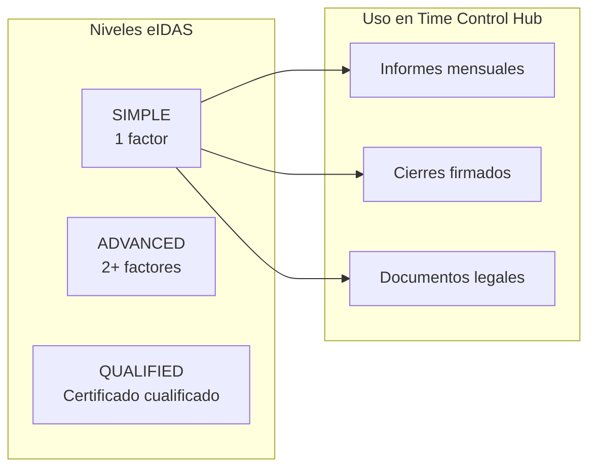

> **Nota**: Time Control Hub utiliza **firma simple (SIMPLE)** basada en un solo factor de autenticación, conforme a las necesidades del registro de jornada. El formato es **PAdES-LTV** para validación a largo plazo.

---

## Arquitectura QTSP

### Diagrama de Componentes

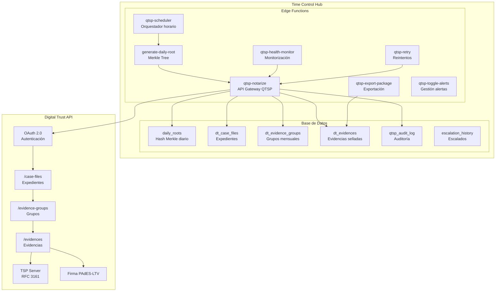

### Flujo de Autenticación OAuth 2.0

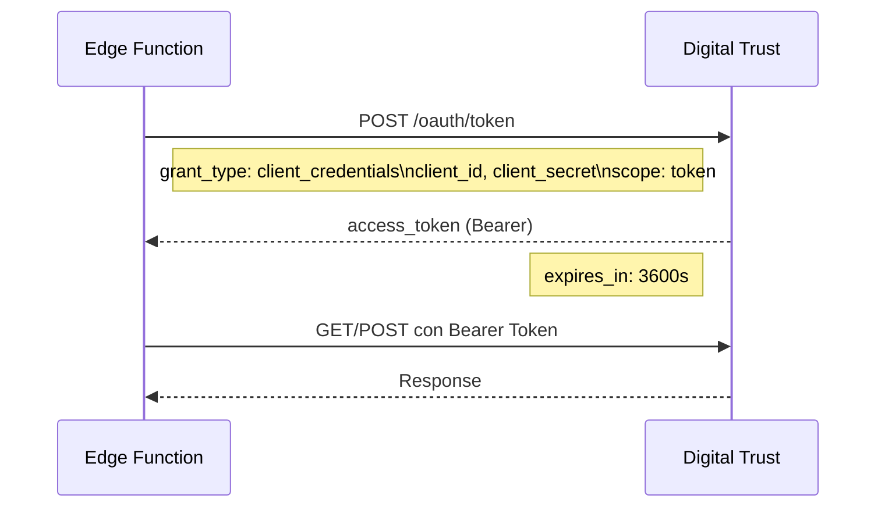

---

## API Reference

### Edge Function: `qtsp-notarize`

Endpoint principal que gestiona todas las operaciones QTSP.

**URL**: `POST /functions/v1/qtsp-notarize`

#### Acciones Disponibles

| Action | Descripción | Parámetros Requeridos |
|--------|-------------|----------------------|
| `health_check` | Verificar conectividad API | - |
| `timestamp_daily` | Sellar hash diario Merkle | `company_id`, `daily_root_id`, `root_hash`, `date` |
| `seal_pdf` | Firmar PDF con PAdES-LTV | `company_id`, `pdf_base64`, `report_month`, `file_name` |
| `check_status` | Verificar estado evidencia | `company_id`, `evidence_id` (opcional) |
| `retry_failed` | Reintentar evidencias fallidas | `company_id` |
| `timestamp_message` | Sellar mensaje | `company_id`, `message_id`, `content_hash` |
| `timestamp_acknowledgment` | Sellar acuse de recibo | `company_id`, `recipient_id`, `content_hash` |
| `timestamp_notification` | Sellar notificación | `company_id`, `notification_id`, `content_hash` |

#### Ejemplo: Health Check

```bash
curl -X POST https://[PROJECT_ID].supabase.co/functions/v1/qtsp-notarize \
  -H "Authorization: Bearer [ANON_KEY]" \
  -H "Content-Type: application/json" \
  -d '{"action": "health_check"}'
```

**Respuesta**:
```json
{
  "success": true,
  "status": "healthy",
  "auth": true,
  "api": true,
  "latency_ms": 245,
  "message": "Digital Trust API is operational"
}
```

#### Ejemplo: Timestamp Daily

```bash
curl -X POST https://[PROJECT_ID].supabase.co/functions/v1/qtsp-notarize \
  -H "Authorization: Bearer [SERVICE_ROLE_KEY]" \
  -H "Content-Type: application/json" \
  -d '{
    "action": "timestamp_daily",
    "company_id": "uuid-empresa",
    "daily_root_id": "uuid-daily-root",
    "root_hash": "abc123def456...",
    "date": "2026-01-06"
  }'
```

**Respuesta**:
```json
{
  "success": true,
  "message": "Daily root timestamped",
  "already_exists": false,
  "evidence": {
    "id": "uuid-evidencia",
    "external_id": "dt-uuid",
    "status": "completed",
    "tsp_token": "MIIxxxxx..."
  }
}
```

#### Ejemplo: Seal PDF

```bash
curl -X POST https://[PROJECT_ID].supabase.co/functions/v1/qtsp-notarize \
  -H "Authorization: Bearer [SERVICE_ROLE_KEY]" \
  -H "Content-Type: application/json" \
  -d '{
    "action": "seal_pdf",
    "company_id": "uuid-empresa",
    "pdf_base64": "JVBERi0xLjQK...",
    "report_month": "2026-01",
    "file_name": "informe_mensual_enero.pdf"
  }'
```

**Respuesta**:
```json
{
  "success": true,
  "sealed_pdf_path": "2026-01/informe_mensual_enero_sealed.pdf",
  "already_exists": false,
  "signature_config": {
    "provider": "EADTRUST",
    "type": "PADES_LTV",
    "level": "SIMPLE",
    "authenticationFactor": 1
  }
}
```

### Edge Function: `qtsp-scheduler`

Orquestador que ejecuta el sellado diario por zona horaria.

**Trigger**: `pg_cron` cada hora (`0 * * * *`)

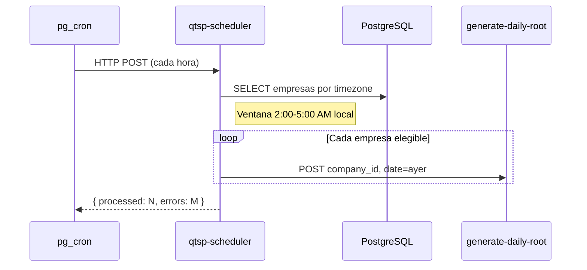

### Edge Function: `generate-daily-root`

Genera el Merkle Root diario de fichajes.

**Algoritmo**:
1. Obtener todos los `time_events` del día
2. Extraer `event_hash` de cada evento
3. Construir árbol Merkle con SHA-256
4. Insertar en `daily_roots`
5. Invocar `qtsp-notarize` para sellar

```typescript
// Algoritmo Merkle Tree
async function buildMerkleRoot(hashes: string[]): Promise<string> {
  if (hashes.length === 0) return '';
  if (hashes.length === 1) return hashes[0];

  const nextLevel: string[] = [];
  for (let i = 0; i < hashes.length; i += 2) {
    const left = hashes[i];
    const right = hashes[i + 1] || left;
    const combined = await computeHash(left + right);
    nextLevel.push(combined);
  }

  return buildMerkleRoot(nextLevel);
}
```

### Edge Function: `qtsp-health-monitor`

Monitoriza la salud del servicio QTSP.

**Trigger**: `pg_cron` cada 5 minutos

**Métricas**:
- Latencia de autenticación
- Disponibilidad de API
- Tasa de éxito de sellados
- Evidencias pendientes

### Edge Function: `qtsp-export-package`

Exporta paquete probatorio de evidencias QTSP.

**Contenido del paquete**:
```
qtsp_export_[empresa]_[fecha]/
├── manifest.json           # Índice con hashes
├── daily_roots/            # Merkle roots por día
│   ├── 2026-01-01.json
│   └── ...
├── evidences/              # Tokens TSP
│   ├── [id]_tsp_token.txt
│   └── ...
├── sealed_pdfs/            # PDFs firmados
│   └── 2026-01/
│       └── informe_sealed.pdf
└── audit_log.json          # Log de operaciones
```

---

## Tipos de Evidencia

### 1. Daily Timestamp (`daily_timestamp`)

Sellado del hash Merkle root diario de todos los fichajes.

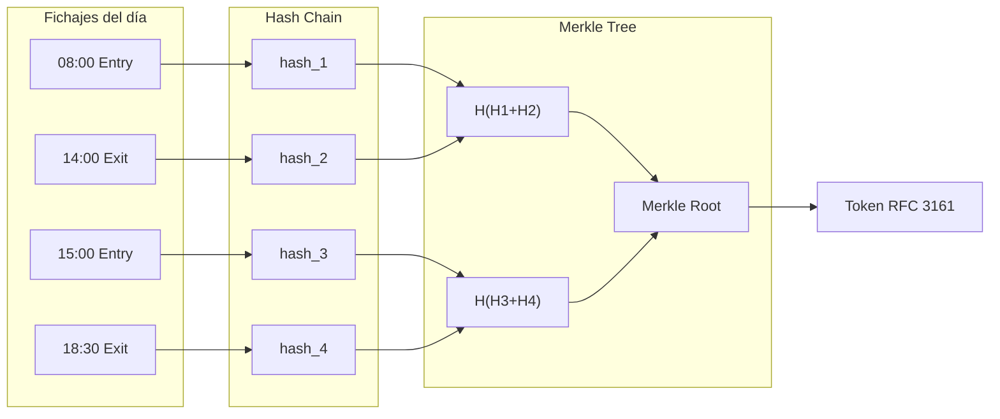

### 2. Monthly Report (`monthly_report`)

Firma digital PAdES-LTV de informes mensuales.

| Campo | Valor |
|-------|-------|
| Tipo | PAdES-LTV |
| Nivel | SIMPLE |
| Factores | 1 (autenticación sistema) |
| Validez | Largo plazo (LTV) |
| Proveedor | EADTrust |

### 3. Message Hash (`message_hash`)

Sellado de contenido de mensajes empresa-empleado.

```typescript
// Cálculo del hash de mensaje
const contentToHash = JSON.stringify({
  id: message.id,
  subject: message.subject,
  body: message.body,
  created_at: message.created_at,
  sender_type: message.sender_type,
});
const hash = await crypto.subtle.digest('SHA-256', encoder.encode(contentToHash));
```

### 4. Acknowledgment (`acknowledgment`)

Sellado de acuses de recibo de mensajes.

### 5. Notification Hash (`notification_hash`)

Sellado de notificaciones de cumplimiento.

---

## Flujos de Sellado

### Flujo 1: Sellado Diario Automático

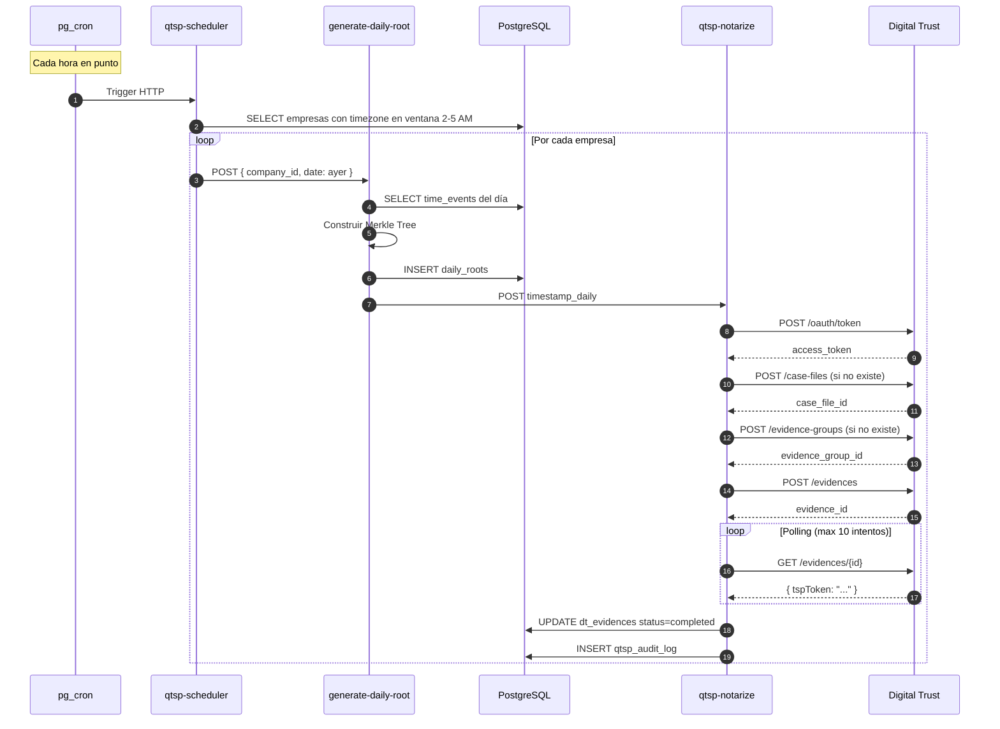

### Flujo 2: Firma de Informe Mensual

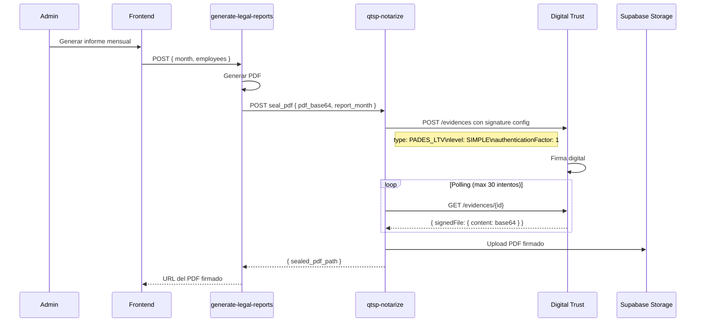

### Flujo 3: Sellado de Mensaje

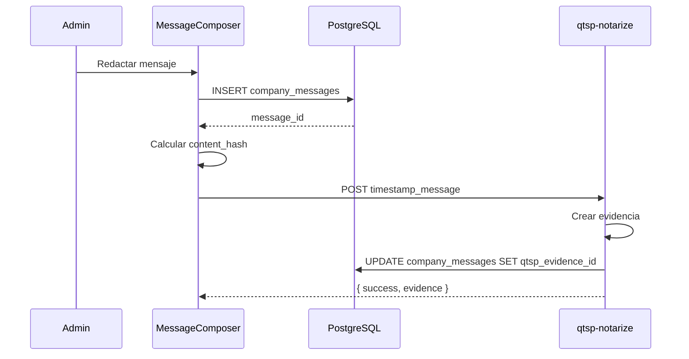

---

## Modelo de Datos

### Diagrama ER QTSP

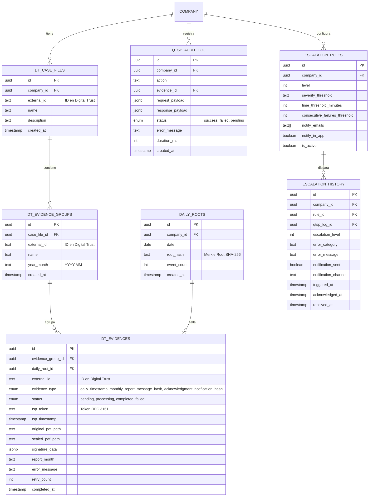

### Estados de Evidencia

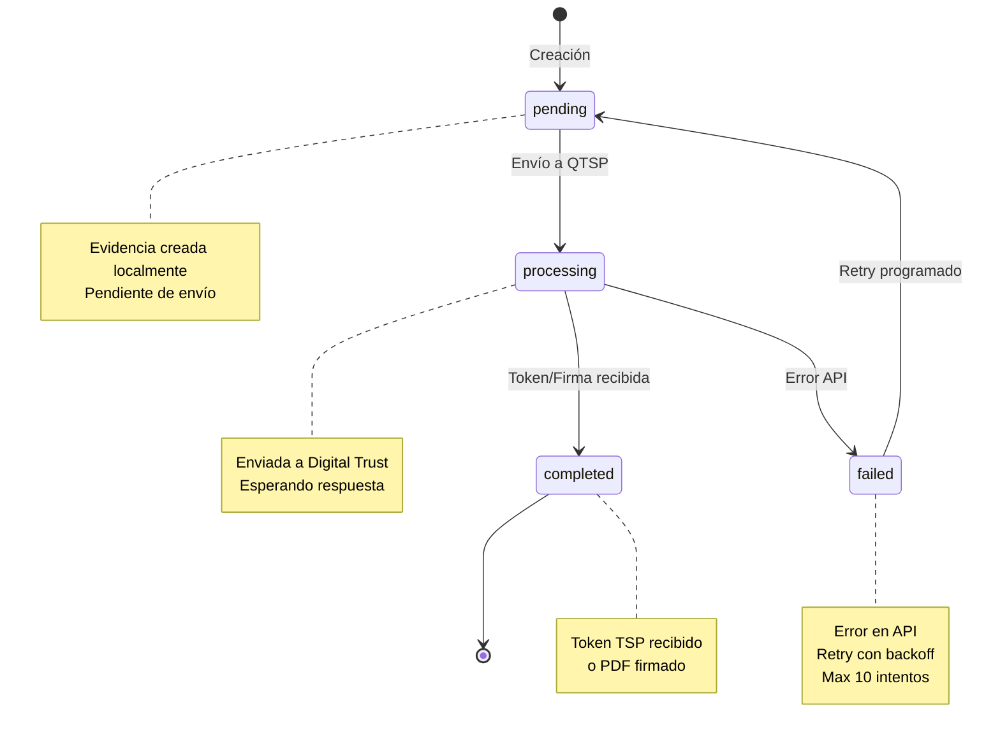

---

## Monitorización

### Panel Super Admin

**Ubicación**: `/super-admin/qtsp`

#### Tabs Disponibles

| Tab | Contenido |
|-----|-----------|
| **Estado** | Health check, métricas en tiempo real |
| **Evidencias** | Calendario de sellados por empresa |
| **Logs** | Auditoría de operaciones QTSP |
| **Tendencias** | Gráficos de éxito/fallos |
| **Escalados** | Gestión de alertas |
| **Errores** | Análisis de fallos por categoría |
| **Exportar** | Generación de paquetes probatorios |
| **Tests** | Tests de integración en vivo |

### Métricas Principales

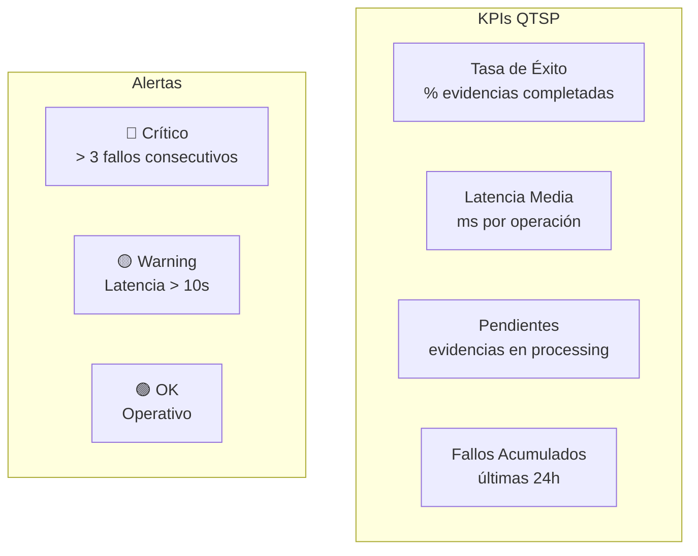

### Integración en Procesos

| Proceso | Integración QTSP |
|---------|------------------|
| **Fichaje Diario** | Merkle root sellado cada noche |
| **Cierre Mensual** | Firma PAdES-LTV del informe |
| **Paquete ITSS** | Manifiesto con tokens TSP |
| **Aceptación Documentos** | Hash sellado por empleado |
| **Mensajes Empresa** | Sellado opcional de contenido |
| **Notificaciones Compliance** | Hash sellado para evidencia |
| **Purga de Datos** | Hash previo a eliminación |

---

## Tests de Integración

### Panel de Tests

**Ubicación**: `/super-admin/qtsp` → Tab "Tests"

#### Tests Disponibles

| Test | Descripción | Validaciones |
|------|-------------|--------------|
| `health_check` | Conectividad API | Auth OK, API OK, Latencia < 5s |
| `timestamp_daily` | Sellado de hash | Token TSP presente |
| `timestamp_notification` | Sellado notificación | Evidence ID generado |
| `seal_pdf` | Firma PAdES-LTV | Config: SIMPLE, factor=1 |
| `check_status` | Verificar estado | Status actualizado |

#### Ejemplo de Resultado

```json
{
  "test": "seal_pdf",
  "status": "success",
  "duration_ms": 1234,
  "validations": {
    "signature_type": "PADES_LTV ✓",
    "signature_level": "SIMPLE ✓",
    "authentication_factor": "1 ✓",
    "provider": "EADTRUST ✓"
  },
  "response": {
    "success": true,
    "test_mode": true,
    "signature_config": {
      "provider": "EADTRUST",
      "type": "PADES_LTV",
      "level": "SIMPLE",
      "authenticationFactor": 1
    }
  }
}
```

---

## Gestión de Errores

### Categorías de Error

| Categoría | Causa | Acción |
|-----------|-------|--------|
| `AUTH_FAILED` | Credenciales inválidas | Verificar secrets |
| `API_UNAVAILABLE` | Digital Trust caído | Retry automático |
| `RATE_LIMITED` | Exceso de peticiones | Backoff exponencial |
| `INVALID_REQUEST` | Parámetros incorrectos | Revisar payload |
| `TIMEOUT` | Polling agotado | Retry en siguiente ciclo |

### Estrategia de Reintentos

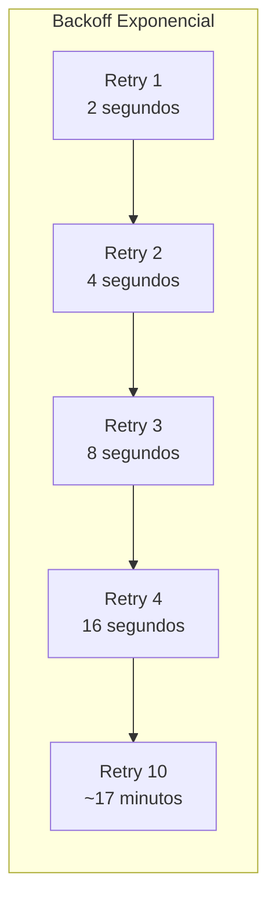

### Escalado de Alertas

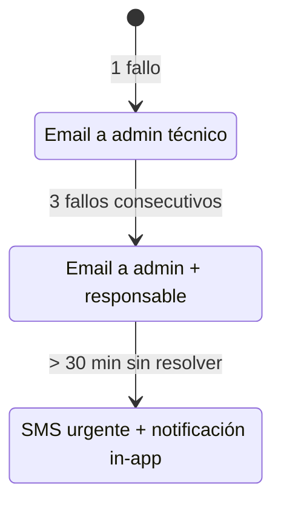

---

## Configuración

### Secretos Requeridos

| Secreto | Descripción | Ejemplo |
|---------|-------------|---------|
| `DIGITALTRUST_API_URL` | URL base API | `https://api.eadtrust.eu` |
| `DIGITALTRUST_LOGIN_URL` | Endpoint OAuth | `https://auth.eadtrust.eu/oauth/token` |
| `DIGITALTRUST_CLIENT_ID` | ID cliente OAuth | `time-control-hub-prod` |
| `DIGITALTRUST_CLIENT_SECRET` | Secret OAuth | `xxx-secret-xxx` |

### Configuración por Empresa

```typescript
interface QTSPSettings {
  enabled: boolean;
  alert_emails: string[];
  escalation_enabled: boolean;
  retry_max_attempts: number;
  notify_on_failure: boolean;
}
```

### Cron Jobs QTSP

| Job | Schedule | Función |
|-----|----------|---------|
| `qtsp-scheduler-hourly` | `0 * * * *` | Sellado por timezone |
| `qtsp-health-check` | `*/5 * * * *` | Monitorización |
| `qtsp-retry-failed` | `30 * * * *` | Reintentos |

---

## Apéndice: Conformidad Legal

### Normativa Aplicable

| Normativa | Artículo | Requisito | Implementación |
|-----------|----------|-----------|----------------|
| **eIDAS** | Art. 41 | Sello de tiempo cualificado | RFC 3161 vía EADTrust |
| **eIDAS** | Art. 25 | Firma electrónica simple | PAdES-LTV nivel SIMPLE |
| **RD-ley 8/2019** | Art. 10 | Registro de jornada | Merkle root diario |
| **ET** | Art. 34.9 | Conservación 4 años | Custodia QTSP |

### Verificación de Firmas

Los tokens TSP y PDFs firmados pueden verificarse mediante:

1. **Herramientas online**: [EU eSignature Validator](https://ec.europa.eu/digital-building-blocks/DSS/webapp-demo/validation)
2. **Adobe Acrobat**: Verificación integrada de firmas PAdES
3. **API Digital Trust**: Endpoint `/verify`

---

<p align="center">
  <strong>Time Control Hub - Integración QTSP</strong><br/>
  Servicios de Confianza Cualificados conforme a eIDAS<br/>
  <br/>
  Proveedor: EADTrust (Digital Trust)
</p>
